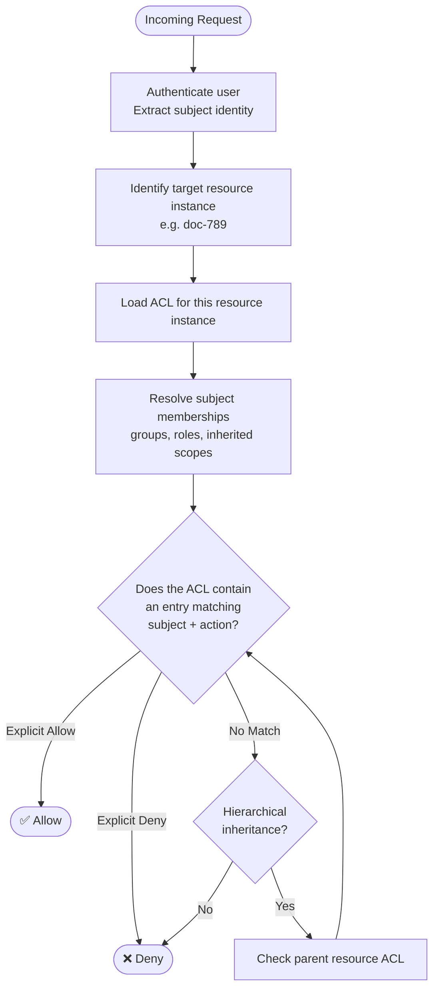
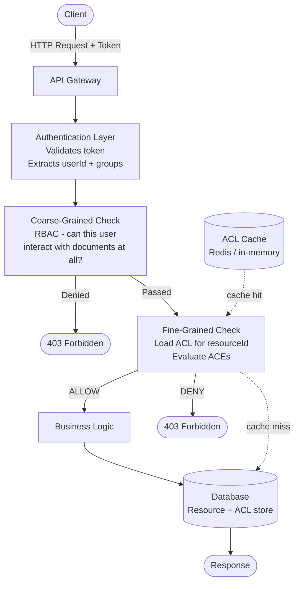

# Fine-Grained Access Control (FGAC)

## 1. Overview

Fine-Grained Access Control (FGAC) is an authorization model that enforces access decisions at the level of **individual resource instances** rather than at the level of resource types or classes. It answers not just "can this user perform this action on this kind of resource?" but "can this user perform this action on **this specific resource**?"

The term "fine-grained" is relative — it contrasts directly with coarse-grained models such as standard RBAC, where a permission like `documents:read` grants access to *all* documents of that type. FGAC introduces a third dimension to the access decision: the identity of the specific object being accessed.

FGAC is not a single, rigid protocol. It is a design principle and a spectrum. Its implementations range from simple ownership checks ("only the creator can edit this record") to sophisticated per-resource permission tables, row-level security policies, and hybrid models that combine relationship graphs with attribute evaluation.

### What problem does FGAC solve?

Most real-world authorization requirements are not uniform across all instances of a resource type. Consider a document management system:

- Two users are both `editors`.
- Alice created Document A; Bob created Document B.
- The business requirement is that editors can only edit *their own* documents.

Standard RBAC cannot express this. The `editor` role grants `documents:update` globally. FGAC closes this gap by associating permissions with specific resource instances rather than resource classes.

### What limitations of simpler models does FGAC address?

| Simpler model | Limitation |
|---|---|
| RBAC | Permissions apply to entire resource classes; no per-instance control |
| Ownership hardcoding | Embeds policy in application code; not auditable or reconfigurable |
| Admin-only isolation | Too blunt; real collaboration requires selective sharing |

FGAC is often layered on top of RBAC rather than replacing it. Coarse-grained role checks gatekeep which users can interact with a feature at all, while FGAC determines which specific objects they can interact with within that feature.

---

## 2. Core Concepts

### 2.1 Subject

A **subject** is the entity requesting access. This is typically an authenticated user, but it can also be a service account, a group, or another automated agent.

**Example:** User `alice` with ID `user-001`.

---

### 2.2 Resource Instance

A **resource instance** is a specific, identifiable object in the system — a row in a database, a file, a project, an order. FGAC operates at this level of granularity.

**Example:** Document with ID `doc-789`, belonging to workspace `ws-42`.

---

### 2.3 Action

An **action** is the operation the subject wants to perform on the resource instance. Actions are typically CRUD-level (`read`, `update`, `delete`) but may also include domain-specific operations (`publish`, `archive`, `share`).

**Example:** `update` — the user wants to modify the content of `doc-789`.

---

### 2.4 Access Control Entry (ACE)

An **Access Control Entry** is a single authorization record that grants (or denies) a specific subject the right to perform a specific action on a specific resource instance. ACEs are the atomic unit of FGAC.

**Example:**
```
{ subject: "user-001", resource: "doc-789", action: "update", effect: "allow" }
```

---

### 2.5 Access Control List (ACL)

An **Access Control List** is the collection of all ACEs for a given resource instance. To evaluate access, the system looks up the ACL for the target resource and searches for a matching entry.

**Example — ACL for `doc-789`:**

| Subject | Action | Effect |
|---|---|---|
| user-001 (Alice) | read, update | allow |
| user-002 (Bob) | read | allow |
| group-editors | read | allow |

---

### 2.6 Owner

An **owner** is a special subject that has full control over a resource instance, typically the user who created it. Ownership is the simplest form of FGAC. The owner may delegate access to others by modifying the resource's ACL.

**Example:** Alice created `doc-789`, so she is its owner. She can read, update, delete, and share it. She can also grant Bob `read` access.

---

### 2.7 Permission Delegation

**Permission delegation** allows a subject who holds access to a resource to grant a subset of their permissions to another subject. This is a powerful feature of FGAC but also a significant source of complexity and privilege escalation risk if not carefully bounded.

**Example:** Alice (`read` + `update` + `share` on `doc-789`) delegates `read` access to Bob. Alice cannot delegate `update` to someone who doesn't already have it, and she cannot delegate permissions she does not herself hold.

---

### 2.8 Scope / Hierarchical Resources

Many systems organize resources in a hierarchy (workspace → project → document → section). FGAC often supports **inherited permissions** where access granted at a higher level in the hierarchy propagates downward to child resources unless overridden.

**Example:** A user granted `read` access to workspace `ws-42` implicitly has `read` access to all documents within `ws-42`, unless a specific document's ACL explicitly restricts it.

---

### 2.9 Wildcard and Group Subjects

Rather than granting access to individual users, ACEs can target **groups** or **roles** as subjects. This makes FGAC more manageable at scale by avoiding per-user entries for every resource instance.

**Example:** Granting the `engineers` group `read` access to a repository means every member of `engineers` inherits that access, without requiring individual ACEs.

---

## 3. How It Works

FGAC requires consulting the specific resource's access control data as part of every authorization decision. This distinguishes it from RBAC where only the user's role assignments are consulted.



**Step-by-step:**

1. **Authenticate** — Confirm who the subject is. FGAC begins after identity is established.
2. **Identify the resource instance** — Extract the specific resource identifier from the request (e.g., `doc-789` from `PUT /documents/doc-789`).
3. **Load the ACL** — Retrieve the access control list for that exact resource instance from the data store.
4. **Resolve subject context** — Expand the subject to include group memberships, role assignments, and any inherited identities that may appear in ACEs.
5. **Match ACEs** — Search the ACL for an entry that matches the subject (directly or via group) and the requested action.
6. **Apply hierarchy** — If no direct match is found and the resource has a parent (e.g., a workspace), recurse upward through the hierarchy to check inherited permissions.
7. **Decision** — Return ALLOW on the first matching allow ACE. Return DENY on any explicit deny ACE, or when no allow is found after exhausting the hierarchy.

---

## 4. Data Model

```
User
├── id: string
├── email: string
└── groupMemberships: string[]  -- list of group IDs

Group
├── id: string
└── name: string

Resource
├── id: string
├── type: string               -- e.g. "document", "project"
├── ownerId: string            -- subject who created this resource
├── parentResourceId: string?  -- for hierarchical inheritance
└── [domain-specific fields]

AccessControlEntry (ACE)
├── id: string
├── resourceId: string         -- the specific resource instance
├── subjectType: enum          -- "user" | "group" | "role"
├── subjectId: string          -- the user, group, or role ID
├── action: string             -- e.g. "read", "update", "delete", "share"
├── effect: enum               -- "allow" | "deny"
├── grantedBy: string          -- who created this ACE (audit)
├── grantedAt: timestamp
└── expiresAt: timestamp?      -- optional time-bounded access
```

**Key relationships:**

- A Resource has zero or more ACEs (its ACL).
- An ACE binds a specific subject to a specific action on a specific resource with an explicit effect.
- A Resource may have a parent Resource; if no matching ACE is found, the parent's ACL is consulted.
- A subject may be a User, a Group (expanding to all members), or a Role.

---

## 5. Authorization Decision

### Inputs

| Input | Description |
|---|---|
| `subjectId` | The authenticated identity of the requester |
| `subjectGroups` | Groups the subject belongs to |
| `resourceId` | The specific resource instance being accessed |
| `action` | The operation being requested |

### Evaluation Logic

```
function authorize(subjectId, subjectGroups, resourceId, action):

    resource = loadResource(resourceId)
    acl = loadACL(resourceId)

    // 1. Check for an explicit deny — deny takes precedence
    for each ace in acl:
        if ace.action == action AND matchesSubject(ace, subjectId, subjectGroups):
            if ace.effect == "deny":
                return DENY

    // 2. Check for an explicit allow
    for each ace in acl:
        if ace.action == action AND matchesSubject(ace, subjectId, subjectGroups):
            if ace.effect == "allow":
                return ALLOW

    // 3. Check parent resource (hierarchical inheritance)
    if resource.parentResourceId exists:
        return authorize(subjectId, subjectGroups, resource.parentResourceId, action)

    // 4. Default deny
    return DENY
```

### Allow conditions

- An ACE with `effect: allow` matching the subject (directly or via group membership) and the requested action exists on the resource's ACL or on a parent resource's ACL.

### Deny conditions

- An explicit `effect: deny` ACE matches the subject and action (explicit deny overrides any allow at the same or lower level).
- No allow ACE is found after exhausting the resource hierarchy.

### Conflicts

When an ACL contains both an allow and a deny ACE that match the same subject and action, **explicit deny wins**. This allows administrators to block specific subjects even when a broader group-level allow might otherwise apply.

**Example:** The `engineers` group has `read` access to a repository. User `charlie` (a member of `engineers`) has an explicit `deny` ACE on that repository. Charlie is denied `read` access despite the group-level allow.

### Default behavior

**Default-deny.** The absence of an ACE is treated as a denial. A resource with an empty ACL is inaccessible to everyone except the owner (and administrators, depending on implementation).

---

## 6. Practical Example

### Scenario: SaaS Document Collaboration Platform

**Users:**

| User ID | Name | Groups |
|---|---|---|
| user-001 | Alice | `team-product` |
| user-002 | Bob | `team-product`, `team-engineering` |
| user-003 | Carol | `team-engineering` |
| user-004 | Dave | (none) |

**Resources:**

| Resource ID | Type | Owner | Parent |
|---|---|---|---|
| ws-10 | workspace | user-001 | — |
| proj-20 | project | user-001 | ws-10 |
| doc-789 | document | user-001 | proj-20 |
| doc-790 | document | user-002 | proj-20 |

**ACL for `doc-789`:**

| Subject | Action | Effect |
|---|---|---|
| user-001 | read, update, delete, share | allow |
| user-002 | read | allow |
| group `team-product` | read | allow |

**ACL for `proj-20`:**

| Subject | Action | Effect |
|---|---|---|
| user-001 | read, update, delete | allow |
| group `team-engineering` | read | allow |

---

**Allowed request — direct ACE:**

> Alice (`user-001`) attempts to update `doc-789`.

1. Load ACL for `doc-789`.
2. Find ACE: `user-001, update, allow`.
3. Decision: **ALLOW**.

---

**Denied request — no matching ACE:**

> Dave (`user-004`, no group memberships) attempts to read `doc-789`.

1. Load ACL for `doc-789`. No ACE matches `user-004`.
2. No group memberships to expand.
3. Recurse to parent `proj-20`. No ACE matches `user-004`.
4. Recurse to parent `ws-10`. No ACL defined (or no matching entry).
5. Decision: **DENY** (default-deny exhausted hierarchy).

---

**Allowed request — group-based ACE with inheritance:**

> Carol (`user-003`, member of `team-engineering`) attempts to read `doc-789`.

1. Load ACL for `doc-789`. No ACE matches `user-003` or `team-engineering`.
2. Recurse to parent `proj-20`.
3. Find ACE: `group: team-engineering, read, allow`. Carol is a member of `team-engineering`.
4. Decision: **ALLOW** (inherited from parent resource via group ACE).

---

**Explicit deny overrides group allow:**

> Bob (`user-002`, member of `team-product`) is added to a deny list for `doc-789`.

ACL for `doc-789` is updated:

| Subject | Action | Effect |
|---|---|---|
| user-002 | read | **deny** |
| group `team-product` | read | allow |

1. Load ACL for `doc-789`.
2. Find explicit deny ACE: `user-002, read, deny`. Deny takes precedence.
3. Decision: **DENY** — even though `team-product` (which Bob belongs to) has a `read:allow` ACE.

---

## 7. Implementation Example

```typescript
// --- Data types ---

type Effect = "allow" | "deny";
type SubjectType = "user" | "group";

interface ACE {
  resourceId: string;
  subjectType: SubjectType;
  subjectId: string;
  action: string;
  effect: Effect;
}

interface Resource {
  id: string;
  ownerId: string;
  parentResourceId?: string;
}

// --- Stores (in-memory for illustration) ---

const resources = new Map<string, Resource>([
  ["doc-789", { id: "doc-789", ownerId: "user-001", parentResourceId: "proj-20" }],
  ["proj-20", { id: "proj-20", ownerId: "user-001", parentResourceId: "ws-10" }],
  ["ws-10",   { id: "ws-10",   ownerId: "user-001" }],
]);

// ACL store: resourceId → list of ACEs
const acls = new Map<string, ACE[]>([
  ["doc-789", [
    { resourceId: "doc-789", subjectType: "user",  subjectId: "user-001",       action: "update", effect: "allow" },
    { resourceId: "doc-789", subjectType: "user",  subjectId: "user-002",       action: "read",   effect: "allow" },
    { resourceId: "doc-789", subjectType: "group", subjectId: "team-product",   action: "read",   effect: "allow" },
  ]],
  ["proj-20", [
    { resourceId: "proj-20", subjectType: "group", subjectId: "team-engineering", action: "read", effect: "allow" },
  ]],
]);

// Group membership store: userId → groupIds[]
const groupMemberships = new Map<string, string[]>([
  ["user-001", ["team-product"]],
  ["user-002", ["team-product", "team-engineering"]],
  ["user-003", ["team-engineering"]],
]);

// --- Authorization logic ---

function isAuthorized(
  userId: string,
  resourceId: string,
  action: string,
  visited = new Set<string>()  // cycle guard for hierarchy traversal
): boolean {
  if (visited.has(resourceId)) return false;
  visited.add(resourceId);

  const resource = resources.get(resourceId);
  if (!resource) return false;

  // Owner always has full access
  if (resource.ownerId === userId) return true;

  const acl = acls.get(resourceId) ?? [];
  const userGroups = groupMemberships.get(userId) ?? [];

  // Helper: does this ACE match the subject?
  const matchesSubject = (ace: ACE): boolean =>
    (ace.subjectType === "user"  && ace.subjectId === userId) ||
    (ace.subjectType === "group" && userGroups.includes(ace.subjectId));

  // 1. Explicit deny check (deny takes priority)
  for (const ace of acl) {
    if (ace.action === action && matchesSubject(ace) && ace.effect === "deny") {
      return false;
    }
  }

  // 2. Explicit allow check
  for (const ace of acl) {
    if (ace.action === action && matchesSubject(ace) && ace.effect === "allow") {
      return true;
    }
  }

  // 3. Recurse into parent resource
  if (resource.parentResourceId) {
    return isAuthorized(userId, resource.parentResourceId, action, visited);
  }

  // 4. Default deny
  return false;
}

// --- Usage ---

console.log(isAuthorized("user-001", "doc-789", "update")); // true  (owner)
console.log(isAuthorized("user-004", "doc-789", "read"));   // false (no ACE, no group)
console.log(isAuthorized("user-003", "doc-789", "read"));   // true  (inherited from proj-20 via team-engineering)
```

---

## 8. Advantages

### Instance-level precision

FGAC enables authorization decisions at the granularity of a single record or file. This supports collaborative workflows where different users have different levels of access to different items, which is impossible in a pure role-based model.

### Natural alignment with resource ownership

Ownership semantics are intuitive for both users and developers. Users understand "I can share my own documents with specific people." Developers can implement this pattern with a straightforward ACE insert.

### Flexible sharing without role proliferation

Sharing a specific resource with a specific user or group requires only an ACE insertion — it does not require creating a new role or modifying any global permission policy. This keeps policy management localized.

### Tenant isolation by default

In a multi-tenant system, each resource belongs to a specific tenant. FGAC naturally enforces isolation because ACEs reference specific resource instances. There are no cross-tenant role grants to worry about.

### Supports collaborative and social workflows

Features like "share with specific users," "invite collaborators," "make public," and "revoke individual access" map directly onto ACE operations. These features are difficult or impossible to implement cleanly with RBAC alone.

### Auditability at the record level

Every access decision can be traced to a specific ACE on a specific resource instance. This enables fine-grained audit trails: "who has access to this document and why?"

---

## 9. Limitations and Trade-offs

### ACL storage at scale

A system with millions of resources and per-resource ACLs requires significant storage. A document platform with 10 million documents, each shared with an average of 5 users, requires 50 million ACE records. Storage and indexing must be designed for this volume from the start.

### Performance: per-request resource lookups

Every authorization check requires loading the ACL for the target resource. Without caching, this is a database read on every protected operation. Hierarchical resolution compounds this by requiring multiple lookups up the resource tree.

### Complexity of hierarchical inheritance

Hierarchical permission inheritance is powerful but difficult to reason about. It can produce surprising behavior — access is granted because of a grandparent resource's ACL entry from months ago that nobody remembers. Tooling to visualize effective permissions is essential.

### No global policy

FGAC has no concept of a global "all users with role X can read all resources of type Y" statement. Implementing such a policy requires either inserting ACEs on every resource (impractical at scale) or layering FGAC with RBAC.

### Delegation management

Allowing users to share resources introduces delegation complexity. Users may grant access they should not, share sensitive resources publicly, or create circular delegation chains. Administrative override and periodic access review tooling is necessary.

### Debugging access issues

When a user reports they cannot access a resource, diagnosing the issue requires inspecting the ACL of the resource and potentially every ancestor resource. This is more complex than inspecting a user's role assignments in RBAC.

### Not a complete authorization solution

FGAC handles instance-level access but typically does not address authentication, rate limiting, data classification, or coarse-grained feature access. It is most effective when combined with RBAC for coarse-grained control.

---

## 10. When to Use It

FGAC is most appropriate when these conditions apply:

- **Users need to own and control individual resources.** File systems, documents, code repositories, and shared workspaces all have natural ownership semantics.
- **Resources are collaboratively shared on a per-instance basis.** Different users need different levels of access to different instances of the same resource type.
- **The number of resources is large but the sharing graph is sparse.** Most resources are shared with a small number of subjects.
- **You need "shared with me" or "make public" features.** These require per-resource permission state.

**Realistic scenarios:**

| Scenario | Why FGAC fits |
|---|---|
| Cloud storage (Dropbox, Google Drive style) | Per-file/folder sharing and ownership |
| SaaS document editor (Notion, Confluence) | Page/workspace-level access with inheritance |
| Source code hosting (GitHub repositories) | Per-repo collaborator access |
| Project management tool | Per-project/board member access |
| API-exposed datasets | Per-dataset read/write/admin grants to tenants or users |

---

## 11. When Not to Use It

- **You only need coarse-grained, role-level access control.** If all users with a given role should have the same access to all resources of a type, RBAC is simpler and sufficient.
- **Your system has a small, fixed set of resources with static access patterns.** The operational overhead of ACL management is not justified.
- **You need policy-driven, context-sensitive decisions.** Environmental attributes like time of day, IP address, or resource sensitivity classification are not naturally expressible in ACLs. Use ABAC or PBAC.
- **Access is derived from organizational relationships rather than explicit grants.** "All members of a department can access that department's data" is better expressed as a relationship (ReBAC) or an attribute policy (ABAC) than as millions of individual ACEs.

---

## 12. Comparison With Other Authorization Models

| Model | Main Idea | Decision Inputs | Complexity | Best For |
|---|---|---|---|---|
| **FGAC** | Per-instance ACLs; explicit grants per subject/resource | Subject identity, resource instance ACL | Medium | Collaborative tools; per-resource sharing; ownership-driven access |
| **RBAC** | Permissions assigned to roles; users assigned to roles | User's role memberships | Low–Medium | Organizations with clear job functions; class-level resource access |
| **ABAC** | Policies evaluated against attributes of subject, resource, and environment | Attribute sets + policy rules | High | Dynamic, context-sensitive access; heterogeneous resource types |
| **PBAC** | Centralized declarative policies evaluated at runtime | User identity, resource, action, context | High | Enterprise-wide unified policy enforcement; regulatory compliance |
| **ReBAC** | Access derived from graph relationships between entities | Graph relationships between user and resource | Medium–High | Social graphs; hierarchical resource ownership; team-based access |

FGAC and ReBAC overlap significantly when hierarchical resources are involved. ReBAC can be thought of as a generalization of FGAC where the "ACL" is replaced by a typed relationship graph. For simple ownership and sharing use cases, FGAC is more straightforward to implement.

---

## 13. Security Considerations

### Privilege escalation via delegation

If users can grant access to others, they must only be able to delegate permissions they themselves hold. A user with `read` access should not be able to grant `write` access to another user. Enforce **grant-what-you-have** semantics at the ACE creation layer.

### ACL tampering

The ACL data store is itself a high-value target. An attacker who can insert, modify, or delete ACEs can grant or revoke arbitrary access. Write operations to the ACL store must be protected by their own authorization check (typically a coarse-grained role check or an owner verification).

### Default-deny enforcement

The system must default to denial when no ACE is found. Any code path that short-circuits the ACL lookup (e.g., assumes access is allowed for a particular resource type) is a vulnerability.

### Orphaned ACEs

When a resource is deleted, its ACEs should be cleaned up. Leaving orphaned ACEs in the data store can lead to authorization errors if a new resource is later created with the same ID (ID reuse is a dangerous anti-pattern in FGAC systems).

### Public access leakage

ACEs that grant access to a wildcard subject (e.g., "all users" or "unauthenticated") effectively make the resource public. These entries must be audited carefully and should require explicit administrative approval.

### Hierarchical privilege amplification

If a user is granted admin access to a parent resource (e.g., a workspace), they may implicitly gain full access to all child resources. This must be documented, limited, and auditable. Inheritance should never silently escalate privileges.

### Authorization caching and ACL freshness

If ACLs are cached, revoked access may remain effective until the cache expires. Implement cache invalidation on ACE deletion. For high-security resources, disable caching or use very short TTLs.

### Tenant boundary enforcement

ACEs must be scoped within a tenant. The `resourceId` must be a globally unique identifier that includes tenant context, or the ACL lookup must always filter by tenant ID, to prevent cross-tenant ACE matching.

### Audit logging

Log every ACE creation, modification, and deletion, including who performed the operation and when. Log authorization decisions (allow and deny) on sensitive resources. This data is essential for incident investigation.

---

## 14. Performance Considerations

### ACL indexing

The primary query pattern is: "find all ACEs where `resourceId = X` and `subjectId IN (user, group1, group2, ...)` and `action = Y`." This query must be supported by an index on `(resourceId, subjectId, action)`. Without an appropriate index, ACL lookups degrade to full table scans as ACE volume grows.

### Caching ACLs per resource

Cache the ACL for each resource instance keyed by `resourceId`. This is effective because ACLs change infrequently relative to the rate of read authorization checks. Invalidate the cache when any ACE for the resource is modified.

```
cache.set(`acl:${resourceId}`, acl, { ttl: 60 })  // cache for 60 seconds
```

### Precomputing effective permissions

For frequently accessed resources with deep inheritance hierarchies, precompute and cache the effective permission set (the union of all inherited ACEs from all ancestors). Store this as a materialized view that is invalidated when any ancestor's ACL changes.

### Batch ACL resolution

When loading a list of resources (e.g., a project's documents), avoid checking authorization per resource in a loop. Load all relevant ACEs for the set of resource IDs in a single query, then evaluate in memory.

```sql
SELECT * FROM access_control_entries
WHERE resource_id IN (?, ?, ?, ...)
  AND (subject_id = ? OR subject_id IN (group_ids))
  AND action = ?
```

### Hierarchical lookup depth

Cap the maximum depth of hierarchical ACL traversal to prevent unbounded recursion. A depth limit of 5–10 levels is sufficient for most systems and prevents performance degradation from deep nesting.

### Denormalized subject resolution

Expand group memberships to user IDs during group modification rather than at authorization time. Store a denormalized mapping of `userId → [groupId, ...]` in a cache to avoid recursive group expansion on every request.

---

## 15. Testing Strategy

### Unit tests — ACE matching

```
Test: Direct user ACE allow
Given: ACL for "doc-789" contains { subject: "user-001", action: "update", effect: "allow" }
When:  isAuthorized("user-001", "doc-789", "update")
Then:  ALLOW
```

```
Test: Default deny with no matching ACE
Given: ACL for "doc-789" contains no entry for "user-004"
When:  isAuthorized("user-004", "doc-789", "read")
Then:  DENY
```

```
Test: Group-based allow
Given: "user-003" is a member of "team-engineering"
       ACL for "doc-789" contains { subject: "team-engineering", action: "read", effect: "allow" }
When:  isAuthorized("user-003", "doc-789", "read")
Then:  ALLOW
```

### Unit tests — deny precedence

```
Test: Explicit deny overrides group allow
Given: ACL contains { subject: "team-product", action: "read", effect: "allow" }
       ACL contains { subject: "user-002", action: "read", effect: "deny" }
       "user-002" is a member of "team-product"
When:  isAuthorized("user-002", "doc-789", "read")
Then:  DENY
```

### Unit tests — hierarchical inheritance

```
Test: Access inherited from parent resource
Given: ACL for "doc-789" has no entry for "user-003"
       ACL for parent "proj-20" contains { subject: "user-003", action: "read", effect: "allow" }
When:  isAuthorized("user-003", "doc-789", "read")
Then:  ALLOW
```

```
Test: Hierarchy traversal stops at explicit deny
Given: ACL for "doc-789" contains { subject: "user-003", action: "read", effect: "deny" }
       ACL for parent "proj-20" contains { subject: "user-003", action: "read", effect: "allow" }
When:  isAuthorized("user-003", "doc-789", "read")
Then:  DENY (deny at child resource level is not overridden by parent allow)
```

### Negative authorization tests

```
Test: Viewer cannot perform write operations
Given: "user-002" has only { action: "read", effect: "allow" } on "doc-789"
Then:  DENY for "update", "delete", "share"
```

```
Test: ACL modification requires ownership or admin
Given: "user-002" has "read" access to "doc-789" (user-001 is owner)
When:  "user-002" attempts to add a new ACE to "doc-789"
Then:  DENY (user-002 does not have "share" or "admin" permission)
```

### Privilege escalation tests

```
Test: User cannot grant permissions they do not hold
Given: "user-002" has "read" access to "doc-789"
When:  "user-002" attempts to grant "update" access to "user-004"
Then:  Request is rejected (user-002 cannot delegate a permission they don't hold)
```

### Multi-tenant isolation tests

```
Test: ACEs do not cross tenant boundaries
Given: "user-001" is an owner of a resource in "tenant-A"
When:  "user-001" attempts to access a resource in "tenant-B"
Then:  DENY (no ACE exists in tenant-B for user-001)
```

### Integration tests

```
Test: ACE revocation takes immediate effect
Given: "user-002" has "read" access to "doc-789"
When:  The ACE is deleted
Then:  isAuthorized("user-002", "doc-789", "read") returns DENY
       (validates cache invalidation)
```

```
Test: Resource deletion cleans up ACEs
Given: "doc-789" has 5 ACEs
When:  "doc-789" is deleted
Then:  All 5 ACEs are removed from the ACL store
```

---

## 16. Real-World Architecture

FGAC introduces a per-resource data dependency into the authorization path, which has implications for where and how authorization is evaluated.



### Layered architecture: RBAC + FGAC

In most production systems RBAC and FGAC are used together:

- **RBAC** (coarse layer) — Determines whether the user has the right to interact with the resource type at all. A user without the `documents` feature in their subscription or without a staff role cannot proceed.
- **FGAC** (fine layer) — Determines whether the user has access to the specific resource instance they are requesting.

This two-layer design keeps the FGAC ACL store focused on collaboration and sharing semantics rather than gating basic feature access.

### ACL store placement

The ACL store should be colocated with or adjacent to the resource store to enable efficient joins. A relational database with a proper index on the ACE table is a natural fit. For very high read volumes, an in-memory cache layer (Redis) in front of the ACL store reduces per-request latency.

### Authorization in list operations

List endpoints (`GET /documents`) require special handling. The system must return only resources the user is authorized to see. Two approaches:

1. **Post-filter** — Fetch all resources, then filter by ACL. Simple but does not scale (O(n) ACL lookups).
2. **ACL-join query** — Join the resource table with the ACL table to filter at the database level. More complex but efficient.

The ACL-join approach is strongly preferred for production systems with large resource sets.

---

## 17. Common Mistakes

### Mistake 1: Checking ownership in application code instead of the ACL

**Problem:** Authorization logic is written as:
```typescript
if (resource.ownerId !== userId) throw new ForbiddenError();
```

**Why it is dangerous:** This hardcodes ownership as the only access criterion. Sharing a resource with another user, granting read-only access to a team, or implementing any delegation becomes an application-code change rather than a data change. The authorization model is no longer data-driven.

**Correct approach:** Represent the owner as an ACE with full permissions at resource creation time. All authorization checks go through the ACL system, including ownership.

---

### Mistake 2: Loading resources before checking authorization

**Problem:**
```typescript
const document = await db.loadDocument(docId);
if (!isAuthorized(userId, document)) throw new ForbiddenError();
return document;
```

**Why it is dangerous:** The resource is loaded from the database before verifying access. This may expose metadata through error messages or timing side-channels, and it wastes a database query on requests that will be rejected.

**Correct approach:** Check authorization before loading the resource. If ACL data is needed to make the decision, load only the ACL first, not the full resource.

---

### Mistake 3: Not cleaning up ACEs on resource deletion

**Problem:** When a resource is deleted, its ACEs remain in the ACL table.

**Why it is dangerous:** The ACL table grows indefinitely. Orphaned ACEs are confusing during audits. If the resource ID is ever reused (a dangerous practice but one that occurs with sequential IDs), the new resource inherits the old resource's ACL silently.

**Correct approach:** Delete all ACEs for a resource in the same transaction that deletes the resource. Use a database foreign key constraint with `ON DELETE CASCADE` if the schema supports it.

---

### Mistake 4: Allowing unbounded hierarchical traversal

**Problem:** The authorization function recursively traverses the resource hierarchy without a depth limit.

**Why it is dangerous:** A deeply nested resource hierarchy (or a maliciously crafted cycle) can cause the authorization function to make dozens of recursive database queries, creating a denial-of-service vector.

**Correct approach:** Impose a maximum traversal depth (e.g., 10 levels). Log a warning and return DENY if the depth is exceeded.

---

### Mistake 5: Granting access to a parent resource without understanding the scope of inheritance

**Problem:** An administrator grants a user `admin` access to a workspace, intending to give them admin access to one project within it. All projects and documents in the workspace inherit this grant.

**Why it is dangerous:** Unintended access is granted to resources the administrator did not intend to expose.

**Correct approach:** Provide administrators with tooling that shows the effective permissions a grant will produce (an "effective access preview") before the grant is committed. Always grant at the narrowest scope possible.

---

### Mistake 6: Using sequential integer IDs for resources

**Problem:** Resources use auto-incrementing integer IDs (`doc-1`, `doc-2`, `doc-3`...).

**Why it is dangerous:** In FGAC systems, predictable IDs allow an attacker to enumerate resource IDs and attempt unauthorized access to resources they should not know about, even if ACL checks prevent actual access. Leftover ACEs from deleted resources can also be silently inherited by new resources with reused IDs.

**Correct approach:** Use UUIDs or other non-sequential, non-guessable identifiers for all resources.

---

## 18. Summary

**What it is:** Fine-Grained Access Control is an authorization model that makes access decisions at the level of individual resource instances rather than resource classes. It uses Access Control Lists — collections of explicit grant and deny entries — attached to each resource instance.

**How it works:** On each request, the system identifies the specific resource being accessed, loads its ACL, resolves the subject's group memberships, and evaluates whether any ACE matches the subject and requested action. Explicit denies take precedence over allows. If no match is found, the system recurses up the resource hierarchy before ultimately defaulting to denial.

**Strengths:**
- Enables per-resource, per-user sharing and collaboration
- Natural alignment with ownership semantics
- Strong tenant isolation when resource IDs are properly scoped
- Fine-grained audit trail at the resource-instance level

**Limitations:**
- ACL storage and indexing requirements at scale
- Per-request database reads without aggressive caching
- Hierarchical inheritance adds reasoning complexity
- No native concept of global policies; best combined with RBAC

**When to use it:** FGAC is the right model when your system has collaboration features — sharing, delegating, revoking access to specific items. It excels in document management, cloud storage, project management, and any domain where individual users own and selectively share resources. For pure organizational access control without per-resource sharing, RBAC alone is simpler. For policy-driven, context-sensitive decisions, combine FGAC with ABAC or PBAC.
