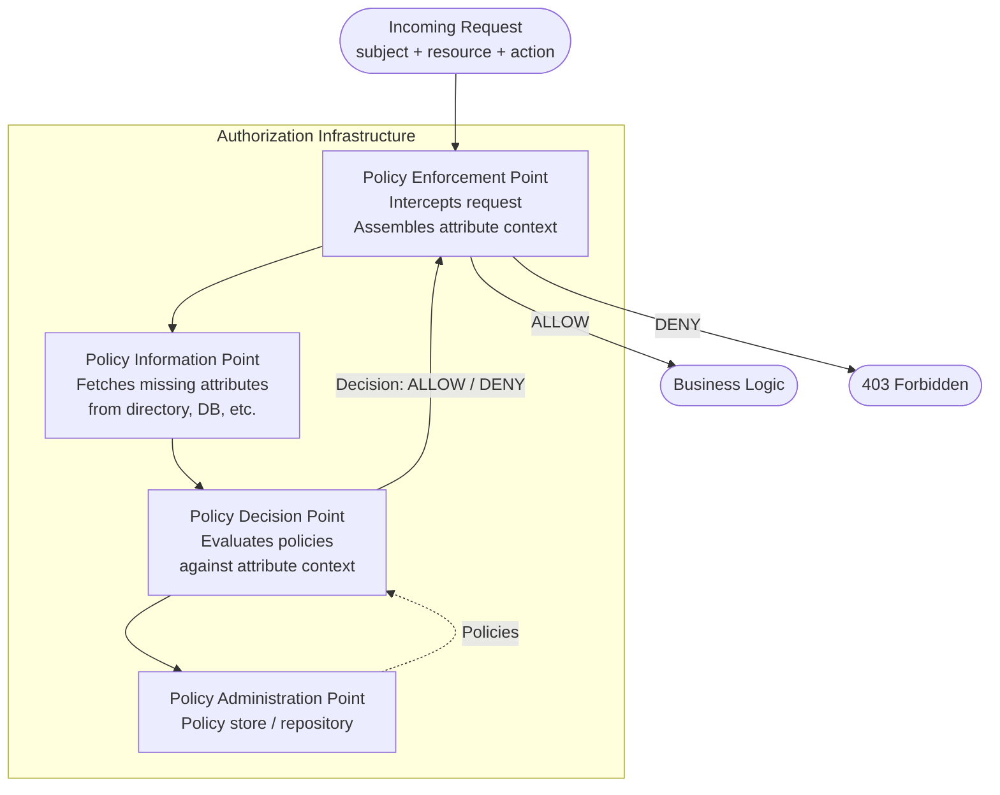
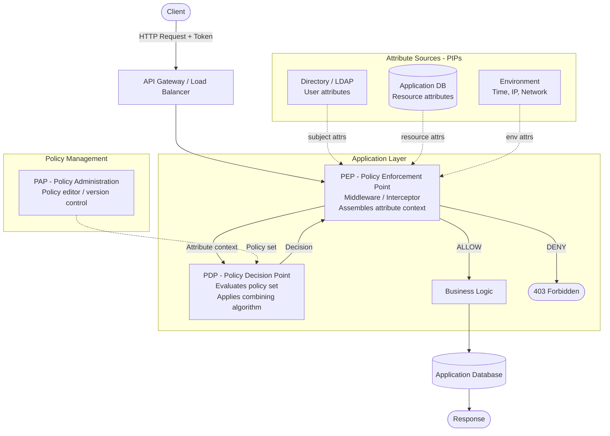

# Attribute-Based Access Control (ABAC)

## 1. Overview

Attribute-Based Access Control (ABAC) is an authorization model in which access decisions are made by evaluating **policies against the attributes of the subject, the resource, the requested action, and the surrounding environment**. Rather than asking "what role does this user have?" or "is this user listed in the resource's ACL?", ABAC asks "do the current attribute values satisfy the conditions defined by the applicable policy?"

The fundamental unit of ABAC is the **attribute** — a named property with a value. Any entity involved in an access request can carry attributes. A policy is a logical expression over those attributes. Authorization is granted when the policy expression evaluates to true.

ABAC is defined and standardized in NIST Special Publication 800-162. It is the model underpinning systems such as AWS IAM policy evaluation, Azure RBAC conditions, and XACML-based enterprise authorization engines.

### What problem does ABAC solve?

Real-world authorization requirements are often conditional on context that changes at runtime:

- "Employees can access HR records only during business hours."
- "Contractors can read documents classified as *internal* but not *confidential*."
- "Users can only access data belonging to their department."
- "API clients can only write to resources that are in *draft* state."

None of these conditions can be expressed in standard RBAC or simple ACLs. They require evaluating attributes — time of day, data classification, department membership, resource state — at the moment the request is made.

ABAC solves this by decoupling the policy logic from the identity graph. Instead of listing which users or roles can access a resource, an ABAC policy describes the *conditions* under which access is permitted, and those conditions are evaluated against live attribute values on every request.

### What limitations of simpler models does ABAC address?

| Simpler model | Limitation addressed by ABAC |
|---|---|
| RBAC | Cannot incorporate contextual attributes; permissions are static |
| FGAC (ACL) | Per-instance grants; no way to express data-classification or environmental conditions |
| Hardcoded ownership | Application-code logic; not auditable or reconfigurable without deployment |

ABAC trades simplicity for expressiveness. It is the most flexible of the common authorization models, but that flexibility comes with real operational costs.

---

## 2. Core Concepts

### 2.1 Attribute

An **attribute** is a key-value pair associated with any entity involved in an access request. Attributes are the raw inputs to ABAC policy evaluation. They can be simple scalar values, sets, or structured objects.

**Attribute categories:**

| Category | Entity | Examples |
|---|---|---|
| Subject attributes | The requester | `user.department = "finance"`, `user.clearanceLevel = "secret"`, `user.employmentType = "contractor"` |
| Resource attributes | The target object | `document.classification = "confidential"`, `project.status = "active"`, `file.ownerId = "user-001"` |
| Action attributes | The operation | `action.name = "read"`, `action.bulk = false` |
| Environment attributes | Context at request time | `env.time = "14:30"`, `env.ipAddress = "10.0.1.5"`, `env.dayOfWeek = "Tuesday"` |

**Example:** A subject attribute `user.department = "engineering"` means the authenticated user belongs to the engineering department.

---

### 2.2 Subject

The **subject** is the entity making the access request — typically an authenticated user, but also a service, a device, or a process. The subject carries a set of attributes that describe it. These attributes are usually sourced from the identity provider, an HR system, or a directory service.

**Example subject attributes:**
```json
{
  "id": "user-042",
  "email": "alice@example.com",
  "department": "engineering",
  "employmentType": "fulltime",
  "clearanceLevel": "internal",
  "location": "us-east"
}
```

---

### 2.3 Resource

The **resource** is the object being accessed. Every resource carries attributes that describe its type, classification, ownership, state, and other relevant properties. These attributes are sourced from the database record representing the resource.

**Example resource attributes:**
```json
{
  "id": "doc-789",
  "type": "document",
  "classification": "internal",
  "status": "published",
  "ownerId": "user-001",
  "department": "engineering",
  "tenantId": "tenant-acme"
}
```

---

### 2.4 Action

The **action** is the operation the subject wants to perform. In ABAC, actions themselves can carry attributes, though in most implementations the action is simply a named operation string (e.g., `read`, `write`, `delete`, `export`).

---

### 2.5 Environment

The **environment** captures contextual information about the request that is not specific to the subject or resource: current time, day of week, the client's IP address, the request's geographic location, whether the request came from an authenticated device, and so on.

**Example environment attributes:**
```json
{
  "currentTime": "09:45",
  "dayOfWeek": "Wednesday",
  "ipAddress": "203.0.113.42",
  "network": "corporate-vpn"
}
```

---

### 2.6 Policy

A **policy** is a declarative logical expression that combines attribute conditions to produce an authorization decision. Policies are the central artifact of ABAC. They are written once by administrators or security architects and evaluated by the authorization engine at runtime.

A policy typically has the form:

```
IF <subject conditions> AND <resource conditions> AND <environment conditions>
THEN <effect: allow | deny>
```

**Example policy (natural language):**
> Allow read access to documents when the user's clearance level is equal to or higher than the document's classification, the document belongs to the same department as the user, and the request is made during business hours.

---

### 2.7 Policy Decision Point (PDP)

The **Policy Decision Point** is the component that evaluates policies against the current attribute set and returns an authorization decision (allow or deny). It is the brain of an ABAC system.

---

### 2.8 Policy Enforcement Point (PEP)

The **Policy Enforcement Point** is the component that intercepts the incoming request, gathers the necessary attributes, sends them to the PDP, and enforces the resulting decision. In a web application, this is typically middleware or a request interceptor.

---

### 2.9 Policy Information Point (PIP)

The **Policy Information Point** is the source of attribute data used during policy evaluation. A PIP can be a database, an LDAP directory, an HR system, a device registry, or any other attribute store. The PDP queries PIPs to resolve attribute values that are not directly included in the request.

---

### 2.10 Policy Administration Point (PAP)

The **Policy Administration Point** is the interface through which administrators create, update, version, and manage policies. It writes policies to the policy store that the PDP reads.

---

### 2.11 Combining Algorithm

When multiple policies apply to a single request, a **combining algorithm** determines how their individual decisions are merged into a final decision. Common algorithms include:

| Algorithm | Behavior |
|---|---|
| `deny-overrides` | Any deny decision causes the overall decision to be DENY |
| `permit-overrides` | Any allow decision causes the overall decision to be ALLOW |
| `first-applicable` | The first policy that produces a decision is used; others are ignored |
| `only-one-applicable` | Exactly one policy must match; conflict causes an error |

The choice of combining algorithm is a critical security decision. `deny-overrides` is the most conservative and is generally recommended for security-sensitive systems.

---

## 3. How It Works

ABAC evaluation follows the XACML conceptual flow, generalized for any implementation.



**Step-by-step:**

1. **Request arrives at the PEP** — The subject makes a request (e.g., `GET /documents/doc-789`). The PEP intercepts it.
2. **Attribute collection** — The PEP extracts known attributes from the authentication token (subject attributes) and the request path/body (resource ID, action). It queries PIPs to resolve additional attributes: the resource's classification from the database, the user's department from LDAP, the current time from the system clock.
3. **Policy retrieval** — The PDP retrieves all policies that are potentially applicable to this resource type and action.
4. **Policy evaluation** — Each policy's conditions are evaluated against the collected attribute set. Each policy produces: ALLOW, DENY, or NOT_APPLICABLE.
5. **Combining algorithm** — The PDP applies the configured combining algorithm to merge all individual policy decisions into a single final decision.
6. **Decision returned** — The PDP returns ALLOW or DENY to the PEP.
7. **Enforcement** — The PEP either allows the request to proceed to business logic or returns a `403 Forbidden` response.

---

## 4. Data Model

```
Subject (User / Service Account)
├── id: string
├── email: string
├── department: string
├── employmentType: enum       -- "fulltime" | "contractor" | "vendor"
├── clearanceLevel: string     -- e.g. "public" | "internal" | "confidential" | "secret"
├── location: string
└── [other subject attributes as needed]

Resource
├── id: string
├── type: string               -- e.g. "document", "invoice", "repository"
├── classification: string     -- e.g. "public" | "internal" | "confidential"
├── status: string             -- e.g. "draft" | "published" | "archived"
├── ownerId: string
├── department: string
├── tenantId: string
└── [other resource attributes as needed]

Action
└── name: string               -- e.g. "read", "write", "delete", "export", "share"

Environment (assembled at request time)
├── currentTime: time
├── dayOfWeek: string
├── ipAddress: string
├── network: string            -- e.g. "corporate-vpn" | "public-internet"
└── [other environmental signals]

Policy
├── id: string
├── name: string
├── description: string
├── effect: enum               -- "allow" | "deny"
├── targetConditions: PolicyExpression   -- which requests this policy applies to
├── subjectConditions: PolicyExpression  -- conditions on subject attributes
├── resourceConditions: PolicyExpression -- conditions on resource attributes
├── actionConditions: PolicyExpression   -- conditions on the action
├── environmentConditions: PolicyExpression -- conditions on env attributes
├── priority: number           -- for conflict resolution if needed
├── version: string
└── createdAt: timestamp

PolicyExpression
└── a logical expression tree combining attribute comparisons:
    attribute == value
    attribute IN [value1, value2]
    attribute >= threshold
    NOT expression
    expression AND expression
    expression OR expression
```

---

## 5. Authorization Decision

### Inputs

| Input | Source |
|---|---|
| Subject attributes | Authentication token + directory/HR system (via PIP) |
| Resource attributes | Database record for the resource (via PIP) |
| Action | Request method and endpoint |
| Environment attributes | System clock, request metadata |

### Evaluation Logic

```
function evaluate(request):
    context = {
        subject:     collectSubjectAttributes(request.userId),
        resource:    collectResourceAttributes(request.resourceId),
        action:      request.action,
        environment: collectEnvironmentAttributes(request)
    }

    applicablePolicies = policies.filter(p => p.targetMatches(context))
    decisions = applicablePolicies.map(p => p.evaluate(context))
    // decisions contains: "allow", "deny", or "not_applicable" per policy

    return applyDenyOverrides(decisions)
    // deny-overrides: if any decision is "deny" → DENY
    // if at least one "allow" and no "deny" → ALLOW
    // if all "not_applicable" → DENY (default-deny)
```

### Allow conditions

A request is allowed when:
- At least one applicable policy evaluates to ALLOW, AND
- No applicable policy evaluates to DENY (under `deny-overrides`).

### Deny conditions

A request is denied when:
- Any applicable policy evaluates to DENY (explicit deny), OR
- No applicable policy evaluates to ALLOW (default-deny from no match), OR
- Attribute retrieval fails and the system is configured to deny on error.

### Conflicts

When both allow and deny policies apply to the same request, the combining algorithm resolves the conflict. Under `deny-overrides`, the deny wins. Under `permit-overrides`, the allow wins. The `deny-overrides` algorithm is strongly recommended for security-sensitive systems.

### Default behavior

**Default-deny.** When no policy produces an ALLOW decision, access is denied. This is the safest default: an incomplete policy set is conservative rather than permissive.

### Policy precedence

Precedence is determined by the combining algorithm and, optionally, a numeric priority field on each policy. In most implementations, policies are evaluated independently and combined — rather than chained in a strict order — making explicit priority fields rarely necessary.

---

## 6. Practical Example

### Scenario: SaaS Legal Document Management Platform

**Policies:**

**Policy 1 — Standard document access:**
> ALLOW read when:
> - `user.employmentType == "fulltime"` AND
> - `document.classification == "internal"` AND
> - `document.department == user.department` AND
> - `env.dayOfWeek IN ["Monday","Tuesday","Wednesday","Thursday","Friday"]`

**Policy 2 — Confidential access for cleared users:**
> ALLOW read when:
> - `user.clearanceLevel == "confidential"` AND
> - `document.classification IN ["internal", "confidential"]`

**Policy 3 — Block contractor access to confidential documents:**
> DENY read when:
> - `user.employmentType == "contractor"` AND
> - `document.classification == "confidential"`

**Policy 4 — Block all access from non-corporate networks to confidential docs:**
> DENY read when:
> - `document.classification == "confidential"` AND
> - `env.network != "corporate-vpn"`

---

**Users:**

| User | Department | Employment Type | Clearance Level |
|---|---|---|---|
| Alice | legal | fulltime | confidential |
| Bob | legal | contractor | internal |
| Carol | engineering | fulltime | internal |

**Resource:** `doc-555` — `{ classification: "confidential", department: "legal" }`

---

**Allowed request:**

> Alice (fulltime, legal, clearance: confidential) reads `doc-555` on Tuesday from corporate-vpn.

- Policy 1: `employmentType = fulltime` ✓, `classification = internal` ✗ (doc is confidential) → NOT_APPLICABLE
- Policy 2: `clearanceLevel = confidential` ✓, `classification IN [internal, confidential]` ✓ → **ALLOW**
- Policy 3: `employmentType = contractor` ✗ → NOT_APPLICABLE
- Policy 4: `classification = confidential` ✓, `network = corporate-vpn` ✓ → NOT_APPLICABLE (condition requires `!= corporate-vpn`)

Combining (`deny-overrides`): one ALLOW, no DENY → **ALLOW**.

---

**Denied request — contractor blocked by explicit deny:**

> Bob (contractor, legal, clearance: internal) reads `doc-555` from corporate-vpn.

- Policy 1: `employmentType = fulltime` ✗ → NOT_APPLICABLE
- Policy 2: `clearanceLevel = confidential` ✗ → NOT_APPLICABLE
- Policy 3: `employmentType = contractor` ✓, `classification = confidential` ✓ → **DENY**
- Policy 4: `network = corporate-vpn` → NOT_APPLICABLE

Combining: one DENY → **DENY** (deny-overrides).

---

**Denied request — wrong department:**

> Carol (fulltime, engineering, clearance: internal) reads `doc-555`.

- Policy 1: `employmentType = fulltime` ✓, `classification = internal` ✗ (doc is confidential) → NOT_APPLICABLE
- Policy 2: `clearanceLevel = internal` ✗ (policy requires confidential) → NOT_APPLICABLE
- Policy 3: `employmentType = contractor` ✗ → NOT_APPLICABLE
- Policy 4: NOT_APPLICABLE

Combining: all NOT_APPLICABLE → default-deny → **DENY**.

---

## 7. Implementation Example

```typescript
// --- Attribute types ---

interface SubjectAttributes {
  id: string;
  department: string;
  employmentType: "fulltime" | "contractor" | "vendor";
  clearanceLevel: "public" | "internal" | "confidential" | "secret";
}

interface ResourceAttributes {
  id: string;
  classification: "public" | "internal" | "confidential" | "secret";
  department: string;
  status: string;
}

interface EnvironmentAttributes {
  network: "corporate-vpn" | "public-internet";
  dayOfWeek: string;
}

interface AccessRequest {
  subject: SubjectAttributes;
  resource: ResourceAttributes;
  action: string;
  environment: EnvironmentAttributes;
}

type PolicyEffect = "allow" | "deny" | "not_applicable";

// --- Policy type ---

interface Policy {
  id: string;
  effect: "allow" | "deny";
  condition: (req: AccessRequest) => boolean;
}

// --- Policy definitions ---

const policies: Policy[] = [
  {
    id: "policy-1-standard-read",
    effect: "allow",
    condition: (req) =>
      req.action === "read" &&
      req.subject.employmentType === "fulltime" &&
      req.resource.classification === "internal" &&
      req.resource.department === req.subject.department &&
      ["Monday","Tuesday","Wednesday","Thursday","Friday"]
        .includes(req.environment.dayOfWeek),
  },
  {
    id: "policy-2-confidential-cleared",
    effect: "allow",
    condition: (req) =>
      req.action === "read" &&
      req.subject.clearanceLevel === "confidential" &&
      ["internal", "confidential"].includes(req.resource.classification),
  },
  {
    id: "policy-3-deny-contractor-confidential",
    effect: "deny",
    condition: (req) =>
      req.subject.employmentType === "contractor" &&
      req.resource.classification === "confidential",
  },
  {
    id: "policy-4-deny-non-vpn-confidential",
    effect: "deny",
    condition: (req) =>
      req.resource.classification === "confidential" &&
      req.environment.network !== "corporate-vpn",
  },
];

// --- PDP: deny-overrides combining algorithm ---

function evaluate(request: AccessRequest): "allow" | "deny" {
  let hasAllow = false;

  for (const policy of policies) {
    if (!policy.condition(request)) continue; // not applicable

    if (policy.effect === "deny") {
      return "deny"; // deny-overrides: first deny wins immediately
    }

    if (policy.effect === "allow") {
      hasAllow = true;
    }
  }

  return hasAllow ? "allow" : "deny"; // default-deny if no allow matched
}

// --- Usage ---

const alice: SubjectAttributes = {
  id: "user-001", department: "legal",
  employmentType: "fulltime", clearanceLevel: "confidential",
};
const doc555: ResourceAttributes = {
  id: "doc-555", classification: "confidential",
  department: "legal", status: "published",
};
const env: EnvironmentAttributes = { network: "corporate-vpn", dayOfWeek: "Tuesday" };

console.log(evaluate({ subject: alice, resource: doc555, action: "read", environment: env }));
// → "allow"

const bob: SubjectAttributes = {
  id: "user-002", department: "legal",
  employmentType: "contractor", clearanceLevel: "internal",
};
console.log(evaluate({ subject: bob, resource: doc555, action: "read", environment: env }));
// → "deny"
```

---

## 8. Advantages

### Maximum expressiveness

ABAC can express any access rule that can be phrased as a logical condition over attribute values. This includes time-based rules, location-based rules, data classification gates, multi-party conditions, and cross-entity attribute comparisons.

### Context-sensitive decisions

Because environment attributes are evaluated at request time, ABAC can make decisions that change dynamically based on where the user is, what time it is, what state the resource is in, or what device is being used. Static models like RBAC cannot do this.

### Policy reuse without role explosion

A single policy like "employees in department X can read resources owned by department X" applies to all employees and all resources in that department simultaneously, without requiring per-user role assignments or per-resource ACEs. This eliminates the role explosion and ACL sprawl problems.

### Fine-grained without per-resource overhead

ABAC achieves fine-grained access control through attribute matching rather than per-resource ACE storage. A policy that gates access on `resource.classification` applies automatically to every resource with that classification attribute, requiring no additional per-resource setup.

### Separation of concerns

Policy authors work in the PAP (a policy editor or declarative policy language) and do not need to touch application code. Developers implement the PEP and PIP. Security architects own policy logic. This separation allows each team to work independently.

### Natural fit for regulatory compliance

Regulations often mandate attribute-based controls: "only staff with clearance level X may access data classified as Y." These requirements map directly to ABAC policies without requiring artificial role definitions.

---

## 9. Limitations and Trade-offs

### Policy complexity

ABAC policies can become extremely complex. A policy set with dozens of interacting allow and deny rules, multiple combining algorithms, and attributes from five different PIPs is difficult for any individual to fully reason about. The risk of unintended permission gaps or unintended access is real.

### Performance overhead

Collecting attributes from multiple PIPs (database, LDAP, external APIs) on every request introduces latency. A single authorization decision may require 3–5 external data fetches. Without aggressive caching, this can be a bottleneck at high request volumes.

### Attribute freshness vs. caching

Caching attribute values (e.g., a user's department from LDAP) introduces a window where stale data influences decisions. A user whose department changes may retain access under the old policy for the duration of the cache TTL. Balancing performance with attribute freshness is an ongoing operational challenge.

### Debugging is hard

When a request is unexpectedly denied, diagnosing the cause requires inspecting every policy that evaluated against the request, the attributes that were collected, and the combining algorithm result. Without good tooling and logging, this is time-consuming.

### Policy management at scale

As the number of policies grows, maintaining consistency becomes difficult. Policies can conflict in subtle ways. Changes to one policy can have unexpected side effects on another. Regression testing the policy set is essential but often neglected.

### Attribute sprawl

Over time, the number of attribute sources and attribute names tends to proliferate. Without a governed attribute taxonomy, different parts of the system use inconsistent attribute names (`user.dept` vs. `user.department` vs. `subject.departmentCode`), leading to policy evaluation errors.

### High implementation cost

A production-grade ABAC system requires implementing or deploying all four XACML components (PEP, PDP, PIP, PAP). This is significantly more infrastructure than a role or ACL check. For simple access control requirements, this investment is not justified.

---

## 10. When to Use It

ABAC is well-suited to systems with the following characteristics:

- **Access requirements are conditional on context.** If access should depend on time, location, network, device, or resource state, ABAC is appropriate.
- **The authorization model involves data classification.** Healthcare, government, finance, and legal systems often classify data and restrict access by clearance or classification level — this maps naturally to ABAC.
- **The user population is large and heterogeneous.** ABAC scales elegantly when there are many users across many departments, because policies are written against attributes rather than individual identities.
- **Compliance mandates attribute-based controls.** HIPAA minimum necessary, GDPR data minimization, and government security clearance models all benefit from ABAC policies.

**Realistic scenarios:**

| Scenario | Why ABAC fits |
|---|---|
| Government document management | Classification levels + clearance levels + time restrictions |
| Healthcare record access | Department-based access + patient consent attributes + role |
| Financial services | Jurisdiction-based access + customer tier + regulatory hold status |
| Cloud provider IAM (e.g., AWS) | Resource tags + user attributes + environment conditions |
| Enterprise API gateway | Subscription tier + rate-limit attributes + geographic restrictions |

---

## 11. When Not to Use It

- **Your access model is simple and role-driven.** If users fall into a small number of job functions with static permissions, RBAC is far simpler to implement and maintain.
- **You need per-resource sharing.** "Share this document with Bob" is an explicit grant, not a policy condition. FGAC handles this more naturally and efficiently.
- **Your team lacks policy engineering expertise.** Writing correct, non-conflicting ABAC policies requires skill and discipline. A poorly maintained ABAC policy set is more dangerous than a well-maintained RBAC model.
- **Performance constraints are severe.** If every request must complete in under 5 milliseconds and attribute collection requires external calls, ABAC may be impractical without significant caching investment.
- **Access decisions are driven by graph relationships.** "Members of this team can access its repositories" is a graph relationship, not an attribute. ReBAC handles this more expressively.

---

## 12. Comparison With Other Authorization Models

| Model | Main Idea | Decision Inputs | Complexity | Best For |
|---|---|---|---|---|
| **ABAC** | Policies evaluated against attributes of subject, resource, action, and environment | Attribute sets + policy rules | High | Dynamic, context-sensitive access; data classification; large heterogeneous systems |
| **RBAC** | Permissions assigned to roles; users assigned to roles | User's role memberships | Low–Medium | Organizations with clear job functions; class-level resource access |
| **FGAC** | Per-instance ACLs; explicit grants per subject/resource | Subject identity, resource instance ACL | Medium | Collaborative tools; per-resource sharing; ownership-driven access |
| **PBAC** | Centralized declarative policies evaluated at runtime | User identity, resource, action, context | High | Enterprise-wide unified policy enforcement; regulatory compliance |
| **ReBAC** | Access derived from graph relationships between entities | Graph relationships between user and resource | Medium–High | Social graphs; hierarchical resource ownership; team-based access |

ABAC and PBAC are closely related. PBAC can be considered a refinement of ABAC that places stronger emphasis on policy lifecycle management, versioning, and enterprise-wide governance. In practice, many ABAC implementations are also PBAC implementations; the distinction lies in operational maturity rather than technical mechanism.

---

## 13. Security Considerations

### Attribute injection

If subject attributes are sourced from user-controlled data (e.g., a JWT with user-defined claims), an attacker may inject false attributes to gain unauthorized access. Attributes used in policy evaluation must originate from authoritative, server-controlled sources. Never trust attribute values submitted by the client unless they are cryptographically verified.

### Policy bypass via missing attributes

A policy that evaluates to NOT_APPLICABLE when an attribute is missing may inadvertently allow access if the combining algorithm defaults to ALLOW on no-decision. Always configure the default to DENY. Explicitly handle missing attributes in policies (e.g., treat a missing `clearanceLevel` as the lowest possible level, not as a match-all).

### Combining algorithm selection

Using `permit-overrides` means that any single allow policy grants access regardless of explicit deny policies. This is a dangerous default for security-sensitive systems. Use `deny-overrides` unless there is a specific, well-understood reason not to.

### Privilege escalation through attribute manipulation

If users can modify their own resource attributes (e.g., changing a document's `classification` from `confidential` to `public`), they can self-escalate access. Attribute modification must be protected by its own authorization check. Resource attributes used in security-sensitive policies should only be modifiable by privileged users.

### Tenant isolation

In multi-tenant systems, `tenantId` must be included as a required attribute condition in every policy or enforced at the PEP before policy evaluation. A missing `tenantId` condition in one policy is sufficient to create a cross-tenant data leakage vulnerability.

### Authorization caching and attribute staleness

Cached attribute values may not reflect recent changes. A user whose `employmentType` changes from `fulltime` to `contractor` should immediately lose access to resources gated on `employmentType = fulltime`. Implement cache invalidation tied to attribute update events for security-critical attributes.

### Policy change management

A policy change can inadvertently expand or restrict access for thousands of users simultaneously. Policy changes must go through a review and approval workflow, and should be deployed with impact analysis tooling that shows which requests would be affected.

### Audit logging

Log the full attribute context that was evaluated for every authorization decision: which policies were evaluated, which attributes were used, what each policy decided, and the final result. This data is essential for security incident investigation and compliance audits.

### Fail-secure behavior

When attribute collection fails (a PIP is unavailable), the system must fail securely. The authorization decision on a PIP failure should be DENY, not ALLOW. An unavailable HR system should not grant unauthorized access; it should block the request until the system recovers.

---

## 14. Performance Considerations

### Attribute caching

Attributes sourced from external PIPs (LDAP, HR systems, databases) should be cached to avoid external calls on every request. Cache by subject ID and resource ID with appropriate TTLs:

- Subject attributes (department, clearance level): 5–15 minutes TTL (change infrequently)
- Resource attributes (classification, status): 1–5 minutes TTL (may change more often)
- Environment attributes (time, IP): do not cache (computed per request)

### Policy precompilation

Translate declarative policies (JSON, YAML, XACML) into executable functions or bytecode at server startup, not at request time. Recompile when policies change. This eliminates policy parsing overhead from the hot path.

### Policy indexing

Rather than evaluating every policy against every request, index policies by the resource type and action they target. Filter the applicable policy set before evaluation to avoid evaluating policies that cannot possibly match.

```
policyIndex["document"]["read"] → [policy-1, policy-2, policy-3]
policyIndex["invoice"]["delete"] → [policy-5]
```

### Batch authorization

When loading a list of resources, batch the authorization check rather than making n individual decisions. Collect all resource attribute sets, evaluate policies over the set, and filter in a single pass.

### Hot-path attribute preloading

For high-traffic endpoints, preload all attributes needed for policy evaluation in a single batched database query before entering the evaluation loop, rather than loading attributes lazily per policy.

### Avoid synchronous PIP calls in the hot path

Design the PEP to collect all attributes before invoking the PDP. Do not allow individual policy conditions to trigger synchronous external calls during evaluation. All attributes must be available in memory before evaluation begins.

---

## 15. Testing Strategy

### Unit tests — individual policy evaluation

```
Test: Policy-1 allows fulltime employee in matching department during business hours
Given: subject = { employmentType: "fulltime", department: "legal", clearanceLevel: "internal" }
       resource = { classification: "internal", department: "legal" }
       environment = { network: "corporate-vpn", dayOfWeek: "Wednesday" }
       action = "read"
When:  policy-1.condition(request) is evaluated
Then:  returns true → effect: "allow"
```

```
Test: Policy-1 does not apply outside business hours
Given: environment = { dayOfWeek: "Saturday" }
When:  policy-1.condition(request) is evaluated
Then:  returns false → NOT_APPLICABLE
```

### Unit tests — combining algorithm

```
Test: deny-overrides — deny wins over allow
Given: policies return ["allow", "deny", "not_applicable"]
When:  applyDenyOverrides(decisions) is evaluated
Then:  result is "deny"
```

```
Test: default-deny — no applicable policy
Given: all policies return "not_applicable"
When:  applyDenyOverrides(decisions) is evaluated
Then:  result is "deny"
```

### Integration tests — full PEP→PDP flow

```
Test: Full request evaluation with attribute collection
Given: alice (fulltime, legal, confidential clearance) requests read on doc-555 (confidential, legal)
       from corporate-vpn on a weekday
When:  authorize(request) is called end-to-end
Then:  decision is "allow"
       audit log contains: userId, resourceId, policies evaluated, attributes used, decision
```

### Negative authorization tests

```
Test: Contractor denied access to confidential document
Given: bob (contractor, legal) requests read on doc-555 (confidential)
Then:  decision is "deny"
```

```
Test: Access denied from non-VPN network for confidential resource
Given: alice requests read on doc-555 from "public-internet"
Then:  decision is "deny" (policy-4 applies)
```

### Boundary tests — attribute edge cases

```
Test: Missing subject attribute treated as lowest value
Given: user has no "clearanceLevel" attribute
When:  policy-2 (requires clearanceLevel = "confidential") is evaluated
Then:  policy-2 is NOT_APPLICABLE (missing attribute does not match)
       final decision: "deny" (no allow policy matches)
```

```
Test: PIP failure causes deny
Given: resource attribute store is unavailable (PIP error)
When:  authorization is attempted
Then:  decision is "deny" (fail-secure)
       error is logged
```

### Privilege escalation tests

```
Test: User cannot elevate their own clearance level attribute
Given: bob's token claims clearanceLevel = "confidential" (tampered)
When:  the system validates token claims against the authoritative directory
Then:  the tampered claim is rejected; authoritative value "internal" is used
```

### Regression tests for policy changes

```
Test: New deny policy does not block intended access
Given: a new deny policy is added to the policy set
When:  regression suite of known-allowed requests is replayed
Then:  all previously allowed requests that should still be allowed produce "allow"
```

---

## 16. Real-World Architecture

ABAC introduces a dedicated authorization infrastructure layer between authentication and business logic.



### Where authorization happens

The PEP sits at the boundary of the application, typically implemented as:
- An HTTP middleware that runs before route handlers
- A decorator or interceptor on service methods
- An API gateway plugin for gateway-level enforcement

### Centralized vs. distributed PDP

For microservices architectures, there are two common patterns:

1. **Centralized PDP** — A dedicated authorization service that all services call via an internal API. Provides a single source of truth for policies but introduces a network call and a potential single point of failure.
2. **Distributed PDP** — Each service embeds its own policy engine (e.g., Open Policy Agent sidecar). Policies are distributed to each service. Provides low-latency decisions but adds operational complexity in keeping policies synchronized.

### Policy as code

In modern architectures, policies are stored in version control alongside application code. Policy changes go through the same code review and CI/CD process as code changes. Policy test suites (regression tests) run in the pipeline before deployment.

---

## 17. Common Mistakes

### Mistake 1: Trusting client-supplied attributes

**Problem:** The application reads attributes from the JWT payload or request body and passes them directly to the PDP without validation.

**Why it is dangerous:** A client can forge attribute values. `{ "clearanceLevel": "secret" }` in a self-signed or tampered token allows the user to claim any clearance level.

**Correct approach:** Attributes used in security-sensitive policies must be sourced from authoritative server-side PIPs (the database, LDAP, the HR system). Token claims may be used for non-sensitive attributes or as a cache of server-side values, but must be validated against an authoritative source for sensitive decisions.

---

### Mistake 2: Using `permit-overrides` as the default combining algorithm

**Problem:** The combining algorithm is set to `permit-overrides`, meaning any single allow policy grants access regardless of deny policies.

**Why it is dangerous:** An attacker who can make one allow policy applicable (by manipulating attributes) can bypass all deny policies.

**Correct approach:** Use `deny-overrides` as the default. Any deny decision overrides all allows. Reserve `permit-overrides` only for deliberately designed exceptions with documented justification.

---

### Mistake 3: Failing open when a PIP is unavailable

**Problem:** When the attribute store (database, LDAP) is unreachable, the system falls back to allowing the request rather than blocking it.

**Why it is dangerous:** A denial-of-service attack against the attribute store can be used to force all authorization decisions to ALLOW, granting unauthorized access to the entire system.

**Correct approach:** Fail secure. When a required PIP is unavailable and the missing attribute is security-critical, return DENY. Log the PIP failure and alert the operations team.

---

### Mistake 4: Writing policies without a test suite

**Problem:** Policies are written and deployed without automated tests. A policy change is deployed directly to production.

**Why it is dangerous:** A subtle policy change can unexpectedly deny access to legitimate users or grant access to unauthorized ones. Without regression tests, the impact is unknown until users report problems or a security review finds the gap.

**Correct approach:** Build and maintain a policy test suite with known-allow and known-deny cases. Run the suite in CI on every policy change. Treat policy changes as requiring the same rigor as code changes.

---

### Mistake 5: Unbounded attribute collection on the hot path

**Problem:** Each policy condition triggers a separate synchronous database query to fetch the attribute it needs. A request evaluated against 10 policies with 3 attributes each causes 30 database queries.

**Why it is dangerous:** Authorization latency becomes a performance bottleneck, particularly under high request volumes.

**Correct approach:** Collect all required attributes in a single batched query before entering the policy evaluation loop. The PEP should assemble the full attribute context upfront, and the PDP should evaluate policies against an in-memory context object.

---

### Mistake 6: Ignoring attribute taxonomy governance

**Problem:** Different teams define attributes with inconsistent names and semantics. One policy uses `user.dept`, another uses `subject.departmentCode`, and a third uses `employee.division`.

**Why it is dangerous:** Policy authors make incorrect assumptions about which attribute they are referencing. Policies silently evaluate against empty or wrong values, producing incorrect authorization decisions.

**Correct approach:** Define and enforce a governed attribute taxonomy. All PIPs must emit attributes using canonical names defined in a shared schema. Enforce this schema in policy validation tools.

---

## 18. Summary

**What it is:** Attribute-Based Access Control is an authorization model that makes access decisions by evaluating declarative policies against the attributes of the subject (user), resource, action, and environment. Decisions are context-sensitive, dynamic, and driven by attribute values rather than static role assignments or per-resource ACL entries.

**How it works:** On each request, a Policy Enforcement Point collects attributes from authoritative sources, passes them to a Policy Decision Point, which evaluates each applicable policy and applies a combining algorithm (typically deny-overrides) to produce a final allow or deny decision.

**Strengths:**
- Maximum expressiveness — any attribute-based condition can be encoded as a policy
- Context-sensitive decisions based on time, location, classification, and resource state
- Policy reuse eliminates role explosion and per-resource ACL sprawl
- Natural fit for regulatory compliance models based on data classification and clearance levels

**Limitations:**
- High implementation complexity compared to RBAC or FGAC
- Performance overhead from attribute collection across multiple PIPs
- Policy management, debugging, and regression testing require significant discipline
- Risk of policy conflicts and unintended access when the policy set grows unchecked

**When to use it:** ABAC is the right model when authorization requirements are conditional on contextual attributes that cannot be captured by static roles or explicit per-resource grants. It excels in regulated industries, heterogeneous enterprise systems, and environments where data classification and environmental context are first-class authorization concerns. For simpler systems with role-driven or ownership-driven access control, RBAC or FGAC is more practical.
