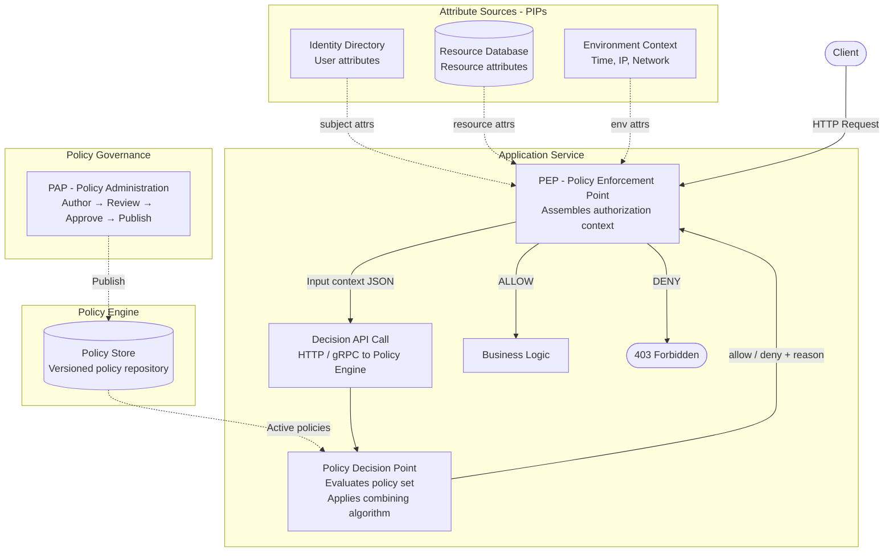
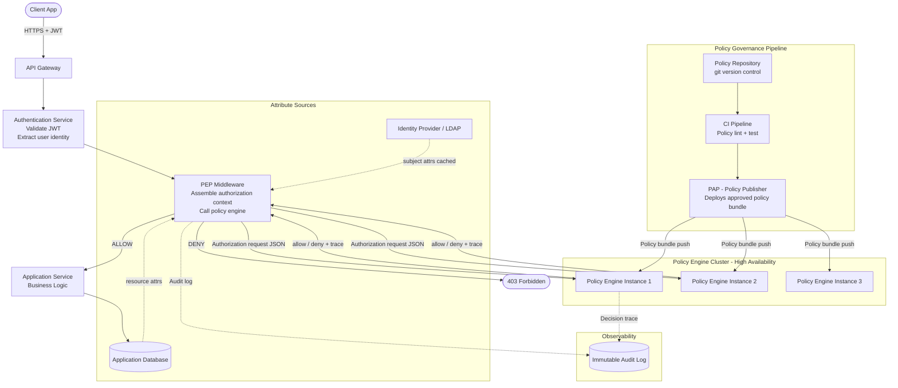

# Policy-Based Access Control (PBAC)

## 1. Overview

Policy-Based Access Control (PBAC) is an authorization model in which access decisions are governed entirely by **centralized, declarative policies** that are defined, versioned, and managed independently of the application code that enforces them. Rather than embedding authorization logic directly into code, or coupling it to role assignments or ACL entries, PBAC externalizes that logic into a dedicated policy layer that can be audited, changed, and deployed without modifying the application itself.

The defining characteristic of PBAC is the **separation of policy definition from policy enforcement**. An application that implements PBAC does not contain the logic "can this user do this thing?" — instead it delegates that question to a policy engine. The engine consults a managed policy store and returns a decision. The application enforces it.

PBAC is often described as an evolution of ABAC in terms of operational maturity. Where ABAC describes *what* inputs a decision evaluates (attributes), PBAC describes *how* those decisions are structured, governed, and managed across an enterprise. In practice, many production PBAC systems evaluate policies against attribute contexts that are conceptually identical to ABAC — the distinction lies primarily in the emphasis on policy lifecycle management, centralization, and organizational governance.

### What problem does PBAC solve?

In large organizations, authorization requirements span many applications, teams, and compliance domains. When each application encodes its own authorization logic:

- Policy changes require code deployments across multiple applications.
- There is no single authoritative view of "what is our access control policy."
- Compliance auditors must inspect each application separately to verify policy adherence.
- Security reviews cannot be performed without access to application code.
- Inconsistencies between applications create privilege gaps and shadow access.

PBAC solves this by treating authorization policy as a first-class organizational artifact — one that is written by security architects, reviewed by compliance teams, stored in version control, tested independently, and deployed to a centralized policy engine that all applications call at runtime.

### What limitations of simpler models does PBAC address?

| Simpler model | Limitation addressed by PBAC |
|---|---|
| RBAC | No centralized governance; roles scattered across multiple systems with no unified view |
| ABAC | Policy logic often embedded in application code; no formal lifecycle management |
| FGAC (ACL) | Per-resource grants are not auditable at an organizational level; no expression of organizational intent |
| Hardcoded logic | Requires code deployment for any policy change; not reviewable by non-engineers |

---

## 2. Core Concepts

### 2.1 Policy

A **policy** is the central artifact of PBAC. It is a declarative, machine-readable statement of authorization intent. A policy defines:

- Under what conditions a subject is permitted or denied to perform an action.
- What resources or resource types the policy governs.
- The effect of the policy (allow or deny).
- The scope of the policy (which tenants, environments, or systems it applies to).

Policies are written in a structured policy language (such as OPA's Rego, Cedar, XACML, or a custom DSL) and stored in a policy repository outside the application.

**Example policy (pseudocode):**
```
policy "allow-employees-to-read-internal-docs" {
  effect = allow
  when {
    subject.employmentStatus == "active"
    subject.department == resource.department
    resource.classification in ["public", "internal"]
    action == "read"
  }
}
```

---

### 2.2 Policy Engine (Policy Decision Point — PDP)

The **policy engine** is the component that evaluates policies against a given authorization context and returns a decision. It is the single authoritative source of authorization decisions in a PBAC system. Applications do not make authorization decisions themselves — they ask the policy engine.

The policy engine:
- Loads the current policy set from the policy store.
- Receives an input context (subject, resource, action, environment).
- Evaluates each applicable policy.
- Applies the combining algorithm.
- Returns ALLOW or DENY (and optionally, a reason or trace).

**Example:** Open Policy Agent (OPA) is a general-purpose policy engine that implements a PBAC approach using the Rego policy language.

---

### 2.3 Policy Store / Repository

The **policy store** is the authoritative repository where policies are maintained. It is managed through the Policy Administration Point (PAP). In modern implementations, the policy store is typically a version-controlled repository (git), a database, or a dedicated policy management platform.

Policies in the store have:
- A unique identifier and version.
- A status (draft, active, deprecated).
- Change history and audit trail.
- Approval workflow metadata.

---

### 2.4 Policy Enforcement Point (PEP)

The **Policy Enforcement Point** is the application-layer component that intercepts a request, collects the authorization context, calls the policy engine, and enforces the resulting decision. It is the bridge between the application and the policy engine.

The PEP does not contain any authorization logic. Its responsibilities are:
1. Intercept the incoming request.
2. Assemble the input context (subject, resource, action, environment).
3. Send the context to the PDP via a decision API.
4. Allow or block the request based on the PDP's response.

---

### 2.5 Policy Administration Point (PAP)

The **Policy Administration Point** is the governance interface through which policies are authored, reviewed, approved, versioned, and published. In an enterprise PBAC system this includes:

- A policy editor (UI or IDE plugin).
- Code review workflow (pull requests, approvals).
- Policy testing tools (what-if analysis, regression testing).
- Deployment pipeline for publishing approved policies to the policy engine.
- Audit log of all policy changes.

---

### 2.6 Policy Information Point (PIP)

The **Policy Information Point** is any external data source that provides attribute values used during policy evaluation. PIPs are queried by the PEP (or the PDP, depending on the architecture) to enrich the authorization context before evaluation.

Examples: user directory (LDAP/AD), HR system, resource metadata database, device registry, threat intelligence feed.

---

### 2.7 Authorization Context

The **authorization context** (also called the "input" or "request") is the complete set of data provided to the policy engine for a single authorization decision. It includes:

- Subject attributes (identity, department, role, clearance level, etc.)
- Resource attributes (type, classification, owner, tenant, etc.)
- Action being requested
- Environment attributes (time, network, IP address, etc.)

The context is assembled by the PEP before calling the PDP.

---

### 2.8 Effect

An **effect** is the outcome a policy produces when its conditions are satisfied: `allow` or `deny`. Every policy declares an effect. The combining algorithm determines the final decision when multiple policies produce conflicting effects.

---

### 2.9 Combining Algorithm

A **combining algorithm** specifies how multiple policy decisions are merged into a single final decision. The same algorithms used in ABAC apply here:

| Algorithm | Behavior |
|---|---|
| `deny-overrides` | Any DENY overrides all ALLOWs — most secure default |
| `permit-overrides` | Any ALLOW overrides all DENYs |
| `first-applicable` | The first matching policy's decision is used |
| `only-one-applicable` | Exactly one policy must match; otherwise: error |

---

### 2.10 Policy Scope

**Policy scope** defines which subjects, resources, tenants, or environments a policy applies to. Scoping allows a single policy store to serve multiple applications, tenants, or deployment environments without applying every policy universally.

**Example:** A policy scoped to `environment: "production"` and `tenant: "acme-corp"` is only evaluated for requests from that tenant in that environment.

---

### 2.11 Policy Versioning

**Policy versioning** is the practice of maintaining a full change history of the policy set, with the ability to roll back to a prior version, diff between versions, and deploy specific versions to specific environments. This is a critical operational capability that distinguishes PBAC from ad-hoc ABAC.

---

## 3. How It Works

PBAC routes every authorization decision through an external policy engine rather than evaluating logic inside the application.



**Step-by-step:**

1. **Request arrives at PEP** — An HTTP request hits the application's enforcement layer.
2. **Context assembly** — The PEP collects subject attributes (from the auth token and PIPs), resource attributes (from the database), action, and environment attributes.
3. **Decision request** — The PEP sends the assembled context to the policy engine's decision API as a structured payload (typically JSON).
4. **Policy evaluation** — The policy engine retrieves applicable policies from its policy store, evaluates each policy's conditions against the input context, and applies the combining algorithm.
5. **Decision returned** — The engine returns `allow` or `deny`, optionally with a reason string and evaluation trace.
6. **Enforcement** — The PEP allows the request to proceed to business logic or returns `403 Forbidden`.

---

## 4. Data Model

```
Subject (assembled by PEP from auth token + PIP)
├── id: string
├── email: string
├── department: string
├── employmentStatus: string    -- "active" | "inactive" | "contractor"
├── roles: string[]             -- coarse-grained role assignments (optional)
├── clearanceLevel: string
└── [additional attributes from PIPs]

Resource (assembled by PEP from application DB)
├── id: string
├── type: string                -- e.g. "document", "invoice", "pipeline"
├── classification: string
├── status: string
├── ownerId: string
├── tenantId: string
└── [domain-specific attributes]

Action
└── name: string               -- "read" | "write" | "delete" | "approve" | "export"

Environment (assembled at request time)
├── timestamp: datetime
├── ipAddress: string
├── network: string
└── [other signals]

Policy (stored in policy repository)
├── id: string
├── name: string
├── description: string
├── version: string            -- semantic version: "1.3.0"
├── status: enum               -- "draft" | "active" | "deprecated"
├── scope: PolicyScope         -- which tenants/environments/resource types this applies to
├── effect: enum               -- "allow" | "deny"
├── conditions: PolicyCondition -- logical expression over context attributes
├── priority: number           -- used to order evaluation if needed
├── createdBy: string
├── approvedBy: string
├── publishedAt: timestamp
└── changeLog: ChangeEntry[]

PolicyScope
├── tenants: string[]?          -- null means all tenants
├── environments: string[]?     -- e.g. ["production", "staging"]
├── resourceTypes: string[]?    -- e.g. ["document", "invoice"]
└── actions: string[]?

AuditLog (immutable, append-only)
├── timestamp: datetime
├── requestId: string
├── subjectId: string
├── resourceId: string
├── action: string
├── decision: "allow" | "deny"
├── policiesEvaluated: string[]  -- list of policy IDs that were evaluated
├── matchedPolicies: string[]    -- policies that produced a decision
└── contextSnapshot: object      -- the full attribute context at evaluation time
```

---

## 5. Authorization Decision

### Inputs

| Input | Source |
|---|---|
| Subject attributes | Authentication token + PIPs (directory, HR system) |
| Resource attributes | Application database |
| Action | HTTP method + endpoint semantics |
| Environment attributes | Request metadata, system clock |
| Policy set | Policy store (active policies matching the scope) |

### Evaluation Logic

```
function authorize(context: AuthorizationContext): Decision {

    // 1. Filter policies to those applicable to this request's scope
    applicablePolicies = policyStore.filter(p =>
        p.status == "active" AND
        p.scope.matches(context.resource.type, context.action.name, context.subject.tenantId)
    )

    if applicablePolicies is empty:
        return { decision: "deny", reason: "no-applicable-policy" }  // default-deny

    decisions = []
    for each policy in applicablePolicies:
        if policy.conditions.evaluate(context):
            decisions.push({ policyId: policy.id, effect: policy.effect })
        else:
            decisions.push({ policyId: policy.id, effect: "not_applicable" })

    // 2. Apply combining algorithm (deny-overrides)
    if any decision.effect == "deny":
        return { decision: "deny", reason: "explicit-deny", matchedPolicies: [...] }

    if any decision.effect == "allow":
        return { decision: "allow", matchedPolicies: [...] }

    return { decision: "deny", reason: "no-allow-policy-matched" }  // default-deny
}
```

### Allow conditions

- At least one applicable, active policy with `effect: allow` has its conditions satisfied by the current context, AND
- No applicable, active policy with `effect: deny` has its conditions satisfied.

### Deny conditions

- Any applicable, active policy with `effect: deny` has its conditions satisfied (explicit deny), OR
- No applicable policy produces an allow decision (default-deny).

### Conflicts

When both allow and deny policies match, `deny-overrides` ensures the deny wins. This is the recommended default for all security-sensitive systems. Document any use of `permit-overrides` explicitly in the policy governance record.

### Default behavior

**Default-deny.** If the applicable policy set is empty, or no policy produces an allow, the decision is DENY. The absence of a policy is not permission.

### Policy precedence

Under `deny-overrides`, explicit precedence between policies is rarely needed. When it is, a numeric `priority` field on each policy determines evaluation order, with higher-priority policies evaluated first. Under `first-applicable`, priority determines which policy's decision is used.

---

## 6. Practical Example

### Scenario: Enterprise SaaS — Financial Reporting Platform

**Policy set:**

**P-01 — Standard analyst read access:**
> ALLOW `read` when:
> - `subject.department == resource.department`
> - `subject.employmentStatus == "active"`
> - `resource.classification IN ["public", "internal"]`
> - `action == "read"`

**P-02 — Restricted export for compliance officers:**
> ALLOW `export` when:
> - `subject.roles CONTAINS "compliance-officer"`
> - `resource.classification IN ["internal", "confidential"]`
> - `env.network == "corporate-vpn"`

**P-03 — Block inactive accounts:**
> DENY all actions when:
> - `subject.employmentStatus != "active"`

**P-04 — Block all access to resources under regulatory hold:**
> DENY all actions when:
> - `resource.status == "regulatory-hold"`

---

**Users:**

| User | Department | Status | Roles |
|---|---|---|---|
| Alice | finance | active | analyst |
| Bob | engineering | active | analyst |
| Carol | finance | active | analyst, compliance-officer |
| Dave | finance | inactive | analyst |

**Resources:**

| Resource | Classification | Department | Status |
|---|---|---|---|
| `report-Q3` | internal | finance | published |
| `report-audit` | confidential | finance | regulatory-hold |

---

**Allowed request:**

> Alice (finance, active) reads `report-Q3` (internal, finance, published).

- P-01: department match ✓, active ✓, classification ✓, action ✓ → **ALLOW**
- P-03: employmentStatus = active → NOT_APPLICABLE
- P-04: status = published → NOT_APPLICABLE

Result: one ALLOW, no DENY → **ALLOW**.

---

**Denied request — wrong department:**

> Bob (engineering, active) reads `report-Q3` (internal, finance).

- P-01: `subject.department (engineering) != resource.department (finance)` → NOT_APPLICABLE
- P-03: active → NOT_APPLICABLE
- P-04: published → NOT_APPLICABLE

Result: all NOT_APPLICABLE → default-deny → **DENY**.

---

**Denied request — inactive user:**

> Dave (finance, inactive) reads `report-Q3`.

- P-01: `employmentStatus != active` → NOT_APPLICABLE
- P-03: `employmentStatus != active` → condition matches → **DENY**
- P-04: published → NOT_APPLICABLE

Result: one DENY → **DENY** (explicit deny via P-03).

---

**Denied request — regulatory hold:**

> Alice (finance, active) reads `report-audit` (regulatory-hold).

- P-01: all conditions met → **ALLOW**
- P-04: `resource.status == "regulatory-hold"` → **DENY**

Result: DENY overrides ALLOW → **DENY** (`deny-overrides`).

---

**Allowed export by compliance officer:**

> Carol (finance, active, compliance-officer) exports `report-audit` from corporate-vpn.

Wait — P-04 applies to `report-audit` regardless of action.

- P-04: `resource.status == "regulatory-hold"` → **DENY** (action is not constrained in P-04)

Result: **DENY** — the regulatory hold blocks all actions, including export, for all users. To allow compliance-officer export of held resources, an explicit scoped policy override would be needed. This illustrates how PBAC forces explicit intent: access must be granted, not assumed.

---

## 7. Implementation Example

The following TypeScript example implements a minimal PBAC engine with a structured policy DSL and the deny-overrides combining algorithm.

```typescript
// --- Types ---

interface SubjectContext {
  id: string;
  department: string;
  employmentStatus: "active" | "inactive";
  roles: string[];
  clearanceLevel?: string;
}

interface ResourceContext {
  id: string;
  type: string;
  classification: "public" | "internal" | "confidential";
  department: string;
  status: string;
  tenantId: string;
}

interface EnvironmentContext {
  network: "corporate-vpn" | "public-internet";
  timestamp: Date;
}

interface AuthorizationContext {
  subject: SubjectContext;
  resource: ResourceContext;
  action: string;
  environment: EnvironmentContext;
}

type PolicyEffect = "allow" | "deny";
type PolicyDecision = PolicyEffect | "not_applicable";

interface Policy {
  id: string;
  effect: PolicyEffect;
  condition: (ctx: AuthorizationContext) => boolean;
}

interface DecisionResult {
  decision: "allow" | "deny";
  reason: string;
  matchedPolicies: string[];
}

// --- Policy definitions ---

const policyStore: Policy[] = [
  {
    id: "P-01-analyst-read",
    effect: "allow",
    condition: (ctx) =>
      ctx.action === "read" &&
      ctx.subject.employmentStatus === "active" &&
      ctx.subject.department === ctx.resource.department &&
      (["public", "internal"] as string[]).includes(ctx.resource.classification),
  },
  {
    id: "P-02-compliance-export",
    effect: "allow",
    condition: (ctx) =>
      ctx.action === "export" &&
      ctx.subject.roles.includes("compliance-officer") &&
      (["internal", "confidential"] as string[]).includes(ctx.resource.classification) &&
      ctx.environment.network === "corporate-vpn",
  },
  {
    id: "P-03-block-inactive",
    effect: "deny",
    condition: (ctx) => ctx.subject.employmentStatus !== "active",
  },
  {
    id: "P-04-block-regulatory-hold",
    effect: "deny",
    condition: (ctx) => ctx.resource.status === "regulatory-hold",
  },
];

// --- Policy Decision Point ---

function evaluate(ctx: AuthorizationContext): DecisionResult {
  const matchedAllows: string[] = [];
  const matchedDenies: string[] = [];

  for (const policy of policyStore) {
    if (!policy.condition(ctx)) continue; // not applicable

    if (policy.effect === "deny") {
      matchedDenies.push(policy.id);
    } else {
      matchedAllows.push(policy.id);
    }
  }

  // deny-overrides
  if (matchedDenies.length > 0) {
    return { decision: "deny", reason: "explicit-deny", matchedPolicies: matchedDenies };
  }
  if (matchedAllows.length > 0) {
    return { decision: "allow", reason: "explicit-allow", matchedPolicies: matchedAllows };
  }
  return { decision: "deny", reason: "no-applicable-policy", matchedPolicies: [] };
}

// --- Usage ---

const alice: SubjectContext = {
  id: "user-001", department: "finance",
  employmentStatus: "active", roles: ["analyst"],
};
const reportQ3: ResourceContext = {
  id: "report-Q3", type: "report",
  classification: "internal", department: "finance",
  status: "published", tenantId: "tenant-acme",
};
const env: EnvironmentContext = { network: "corporate-vpn", timestamp: new Date() };

// Alice reads report-Q3 → allow
console.log(evaluate({ subject: alice, resource: reportQ3, action: "read", environment: env }));
// { decision: 'allow', reason: 'explicit-allow', matchedPolicies: ['P-01-analyst-read'] }

const dave: SubjectContext = {
  id: "user-004", department: "finance",
  employmentStatus: "inactive", roles: ["analyst"],
};
// Dave reads report-Q3 → deny (P-03)
console.log(evaluate({ subject: dave, resource: reportQ3, action: "read", environment: env }));
// { decision: 'deny', reason: 'explicit-deny', matchedPolicies: ['P-03-block-inactive'] }

const reportAudit: ResourceContext = {
  id: "report-audit", type: "report",
  classification: "confidential", department: "finance",
  status: "regulatory-hold", tenantId: "tenant-acme",
};
// Alice reads report-audit → deny (P-04 overrides P-01)
console.log(evaluate({ subject: alice, resource: reportAudit, action: "read", environment: env }));
// { decision: 'deny', reason: 'explicit-deny', matchedPolicies: ['P-04-block-regulatory-hold'] }
```

The `evaluate` function is the PDP. Each call represents one authorization decision. The PEP calls this function and enforces the result before touching business logic.

---

## 8. Advantages

### Centralized, auditable policy governance

All authorization logic lives in one place — the policy store. Security teams, compliance officers, and auditors can inspect the complete, current, and historical state of the organization's access control policy without reading application code. This is a significant operational advantage in regulated industries.

### Policy changes without code deployments

Because policies are externalized from application code, a policy change — such as adding a deny rule for inactive accounts — can be authored, reviewed, approved, and deployed to the policy engine without modifying, testing, or redeploying any application. This dramatically reduces the cycle time for security policy changes.

### Consistency across multiple applications

A single policy engine serves multiple applications. The policy "block all access for inactive accounts" is enforced uniformly across the web API, the mobile API, the admin portal, and the batch processing system — all by calling the same policy engine.

### Rich expressiveness

Like ABAC, PBAC can encode any condition expressible over attributes: time, location, data classification, resource state, user attributes, environmental signals. The full power of the policy language is available.

### Policy lifecycle management

PBAC systems include formal governance tools: version control, code review for policy changes, staging/production environments for policy rollout, rollback capability, and impact analysis ("which requests would this policy change affect?"). These are standard software engineering practices applied to authorization policy.

### Separation of concerns

Developers implement PEPs and PIPs. Security architects own policy authoring. Compliance teams review and approve policies. Each team operates in their own domain without needing to understand the other's technical implementation.

### Enterprise compliance support

PBAC maps naturally to enterprise compliance requirements (SOC 2, ISO 27001, HIPAA, PCI-DSS) that require demonstrable, reviewable access control policies with documented change management.

---

## 9. Limitations and Trade-offs

### Highest operational complexity

PBAC requires implementing and operating all XACML-like components (PEP, PDP, PIP, PAP) plus the governance infrastructure around the policy store (versioning, CI/CD for policies, review workflows). This is a significant investment compared to RBAC or even ABAC.

### Policy engine becomes a critical dependency

Every authorization decision requires calling the policy engine. If the policy engine is unavailable, the entire application stops making authorization decisions. The policy engine must be treated as a high-availability, low-latency service with the same operational rigor as the database.

### Policy language learning curve

Policy languages like Rego (OPA), Cedar, or XACML have their own syntax and semantics. Teams must invest in training, tooling (linters, formatters, test runners), and organizational processes before PBAC delivers its governance benefits.

### Debugging complex policy interactions

When multiple policies interact — especially when a deny overrides an unexpected allow — diagnosing the root cause requires inspecting the full policy set, the input context, and the evaluation trace. Good tooling (decision logs with full traces) is essential and must be built or sourced.

### Policy drift and governance failures

If the policy governance process is not maintained rigorously, the policy set accumulates stale, contradictory, or overly permissive policies over time. A PBAC system with poor governance can be more dangerous than a well-maintained RBAC system, because the complexity hides the vulnerabilities.

### Performance overhead

External policy engine calls add network latency. For services that make many authorization decisions per request (e.g., filtering a list of 1,000 items), each decision requiring a network round-trip is impractical. Caching and batching strategies are mandatory.

### Overkill for simple applications

For applications with a small number of well-defined user roles and straightforward access patterns, PBAC is far more infrastructure than the problem warrants. The organizational overhead of policy authoring, review, and deployment is only justified when the authorization requirements are genuinely complex or compliance-driven.

---

## 10. When to Use It

PBAC is most appropriate when:

- **Multiple applications must share a consistent authorization policy.** If 10 services must all enforce the same access rules, a shared policy engine is far more reliable than duplicating logic across services.
- **Authorization policy changes frequently and must not require code deployments.** Compliance policy updates, security incident response, and regulatory changes all benefit from hot-swappable policies.
- **Compliance requires demonstrable, reviewable, auditable access control.** SOC 2, HIPAA, FedRAMP, PCI-DSS, and similar frameworks are much easier to satisfy with a centralized policy store and change log.
- **Different teams own policy authoring vs. enforcement.** Security architects and compliance officers can own policy logic without requiring developer involvement.
- **The organization has the maturity to operate policy governance infrastructure.**

**Realistic scenarios:**

| Scenario | Why PBAC fits |
|---|---|
| Enterprise SaaS with regulatory compliance | Centralized policy enforcement across all services; auditable change log |
| Government / public sector applications | Formal policy governance required; clearance-based access |
| Financial services platforms | Regulatory hold rules, jurisdiction-based access, insider trading prevention |
| Healthcare systems | HIPAA minimum necessary policies; role + patient consent + department scoping |
| Large-scale microservices | Consistent policy enforcement across 20+ services via shared PDP |
| Internal developer platforms | Unified access control across multiple internal tools and APIs |

---

## 11. When Not to Use It

- **Small applications with simple access requirements.** If you have three roles and a handful of endpoints, RBAC is sufficient. PBAC adds infrastructure cost that isn't justified.
- **Teams without policy engineering expertise or governance discipline.** A PBAC system with an ungoverned policy store is worse than a well-maintained RBAC model.
- **Performance-critical paths with no caching.** If every authorization decision requires a synchronous policy engine call with no caching, the latency budget may be exceeded.
- **Per-resource sharing requirements.** PBAC policies are written at a class/attribute level and cannot express "share this specific document with this specific user." FGAC or ReBAC handles this more naturally.
- **Access patterns driven by social or organizational relationships.** "Members of this team can access its repositories" is a relationship, not a policy condition. ReBAC handles this pattern more expressively.

---

## 12. Comparison With Other Authorization Models

| Model | Main Idea | Decision Inputs | Complexity | Best For |
|---|---|---|---|---|
| **PBAC** | Externalized, centralized declarative policies with formal governance | Subject, resource, action, environment attributes + policy set | Very High | Enterprise-wide consistent enforcement; compliance-driven systems; multi-service architectures |
| **RBAC** | Permissions assigned to roles; users assigned to roles | User's role memberships | Low–Medium | Organizations with clear job functions; class-level resource access |
| **FGAC** | Per-instance ACLs; explicit grants per subject/resource | Subject identity, resource instance ACL | Medium | Collaborative tools; per-resource sharing; ownership-driven access |
| **ABAC** | Policies evaluated against subject/resource/environment attributes | Attribute sets + policy rules | High | Dynamic, context-sensitive access; often embedded in application code |
| **ReBAC** | Access derived from graph relationships between entities | Graph relationships between user and resource | Medium–High | Social graphs; hierarchical resource ownership; team-based access |

The primary distinction between ABAC and PBAC is organizational rather than technical. ABAC describes the decision mechanism (attribute-based evaluation). PBAC describes the operational model (externalized, governed, versioned policy management). A mature ABAC implementation with proper governance is functionally a PBAC system. The label "PBAC" is most useful for emphasizing the governance and lifecycle management aspects.

---

## 13. Security Considerations

### Policy engine as a high-value target

The policy engine and its policy store are the highest-value targets in a PBAC architecture. An attacker who can modify policies can grant themselves arbitrary access. The policy store must be protected with strong access controls, immutable audit logging, and cryptographic integrity verification of deployed policy bundles.

### Policy change authorization

The ability to create, modify, and publish policies must itself be governed by authorization controls. Not every developer should be able to publish policies to the production policy engine. Changes should require multi-party approval (code review + security sign-off) before deployment.

### Fail-secure behavior

If the policy engine is unavailable, the PEP must deny all requests rather than defaulting to allow. A temporarily unavailable policy engine is not a reason to bypass authorization. Monitor the policy engine's availability as a critical service.

### Tenant isolation via policy scope

In multi-tenant systems, policies must always include a tenant scope condition or a tenant-scoped policy set. A policy that grants access without a tenant boundary condition can produce cross-tenant access if a request from tenant B happens to satisfy the conditions written for tenant A.

### Stale policy caching

The policy engine may cache its policy set for performance. If a policy is revoked (e.g., an emergency response to a security incident), the revocation must propagate to all running policy engine instances immediately. Implement an out-of-band policy invalidation mechanism (a push notification or a short TTL with forced refresh).

### Attribute injection

Subject attributes sourced from user-controlled data (JWT custom claims, request headers) must be validated against authoritative PIPs before use in policy evaluation. A user who can inject false attributes into the context can bypass any policy that relies on those attributes.

### Audit logging

Every policy evaluation must be logged with the full input context, the list of policies evaluated, the list of policies that matched, and the final decision. This log is essential for incident response, compliance audits, and policy regression analysis. The log must be immutable and tamper-evident.

### Shadow policy changes

Policy changes that appear minor ("adjust a condition threshold") can have sweeping effects. Before deploying a policy change, run impact analysis: replay recent audit log entries against the new policy set and compare decisions. Deploy with a staged rollout (canary) where possible.

---

## 14. Performance Considerations

### External PDP call latency

The primary performance challenge in PBAC is the network round-trip to the policy engine. Design for this from the start:

- **Co-locate the policy engine.** Run the PDP as a sidecar container alongside each application instance to eliminate cross-network latency.
- **Use a local in-process library.** Some policy engines (e.g., OPA) can be embedded directly into the application as a library, avoiding a network call entirely. Policies are loaded from a local bundle.

### Policy bundle caching

The policy engine should load its policy set from the policy store at startup and cache it in memory. Policy updates are pushed via a bundle update mechanism rather than the engine pulling on every evaluation. Avoid hitting the policy store on each decision.

### Input context assembly bottleneck

Assembling the authorization context from multiple PIPs is often the bottleneck, not the policy evaluation itself. Optimize PIP calls:

- Cache subject attributes (low churn, TTL: 5–15 minutes).
- Cache resource attributes (moderate churn, TTL: 1–5 minutes).
- Pre-fetch resource attributes alongside resource data in the same database query.

### Batch authorization

For list endpoints that return N resources, avoid N individual PDP calls. Either:

1. **Filter at the data layer** — Join the resource query with attribute data and apply policy conditions as database query predicates.
2. **Batch input evaluation** — Send all resource contexts to the PDP in a single call and receive a batch of decisions.

### Partial evaluation / pre-computation

For policies that depend only on subject attributes (not resource attributes), compute the subject's "effective policy context" once per session and cache it. This partial evaluation eliminates per-request PDP calls for conditions that cannot change within a request.

### Policy complexity management

Limit the number of policies in the active policy set. Policies that have become obsolete or redundant should be deprecated and removed. Simpler policy sets evaluate faster and are easier to reason about.

---

## 15. Testing Strategy

### Unit tests — individual policy conditions

```
Test: P-01 allows active analyst in matching department
Given: subject = { department: "finance", employmentStatus: "active", roles: ["analyst"] }
       resource = { classification: "internal", department: "finance", status: "published" }
       action = "read"
When:  P-01.condition(context) is evaluated
Then:  returns true
```

```
Test: P-01 does not apply to mismatched department
Given: subject.department = "engineering", resource.department = "finance"
When:  P-01.condition(context)
Then:  returns false
```

### Unit tests — combining algorithm

```
Test: deny-overrides — DENY wins over ALLOW
Given: P-01 returns "allow", P-04 returns "deny"
When:  evaluate(context) is called
Then:  decision = "deny", matchedPolicies includes "P-04"
```

```
Test: default-deny — no matching policies
Given: no policy condition matches the context
When:  evaluate(context) is called
Then:  decision = "deny", reason = "no-applicable-policy"
```

### Integration tests — full context evaluation

```
Test: Complete authorized request flow
Given: alice (finance, active) requests read on report-Q3 (internal, finance, published)
When:  evaluate(fullContext) is called end-to-end
Then:  decision = "allow"
       matchedPolicies = ["P-01-analyst-read"]
       audit log entry is written with full context snapshot
```

### Negative authorization tests

```
Test: Inactive user denied all actions
Given: user.employmentStatus = "inactive"
Then:  evaluate returns "deny" for any action on any resource (P-03 matches)
```

```
Test: Resource under regulatory hold blocks all access
Given: resource.status = "regulatory-hold"
Then:  evaluate returns "deny" for any subject on any action (P-04 matches)
```

### Policy regression tests

```
Test: Policy change does not break existing authorized access
Given: A new deny policy P-05 is added
When:  All known-allow test cases from the regression suite are replayed
Then:  All previously authorized requests still return "allow"
       Any newly denied request is flagged for review
```

### Privilege escalation tests

```
Test: User cannot inject elevated attributes
Given: JWT contains { "employmentStatus": "active" } but authoritative PIP returns "inactive"
When:  PEP assembles context from authoritative PIP (not token)
Then:  context.subject.employmentStatus = "inactive"
       P-03 matches → decision = "deny"
```

### Multi-tenant isolation tests

```
Test: Policy does not grant cross-tenant access
Given: alice (tenantId: "acme-corp") requests resource with tenantId: "globex-corp"
When:  P-01 condition is evaluated (P-01 does not include tenant scope check)
Then:  Tenant boundary must be enforced at PEP level before policy evaluation
       OR P-01 must include: subject.tenantId == resource.tenantId
```

### Fail-secure tests

```
Test: PIP unavailability causes deny
Given: resource attribute store is unreachable
When:  PEP attempts to assemble resource attributes
Then:  PEP returns "deny" without calling PDP
       Error is logged with request ID
```

---

## 16. Real-World Architecture

PBAC integrates into a modern backend as a dedicated authorization service layer.



### Policy engine deployment patterns

**Sidecar (recommended for low latency):** Each application instance runs a policy engine sidecar. Policies are loaded from a shared bundle and updated via push. Authorization decisions are made in-process or via loopback, avoiding cross-network latency.

**Centralized service:** A shared policy engine cluster (2–3 instances behind a load balancer) serves all applications. Simpler to operate but introduces a network dependency. Must be sized for the combined authorization request volume of all clients.

**Embedded library:** The policy engine is compiled into the application as a library. Maximum performance, but policy updates require application redeployment unless hot-reload is supported.

### Policy CI/CD pipeline

Treat policy changes with the same rigor as code changes:

```
Policy author writes/modifies policy
  → Pull request / code review
  → Automated lint (syntax check)
  → Automated test suite (unit + regression)
  → Security review (for sensitive policies)
  → Merge to main
  → CI builds policy bundle
  → Deploy to staging policy engine
  → Integration tests against staging
  → Promote to production policy engine
  → Monitor decision audit log for anomalies
```

---

## 17. Common Mistakes

### Mistake 1: Failing open when the policy engine is unavailable

**Problem:** The PEP catches a policy engine connection error and defaults to allowing the request to proceed rather than failing.

**Why it is dangerous:** A denial-of-service attack against the policy engine (or an accidental outage) removes all authorization enforcement from the application.

**Correct approach:** Treat policy engine unavailability as a hard error. Return `503 Service Unavailable` or `403 Forbidden` to the client. Alert the on-call team. Never default to ALLOW on authorization infrastructure failure.

---

### Mistake 2: Writing policies that are too broad

**Problem:** A policy is written as "allow read for all active users" with no resource type or tenant scope condition.

**Why it is dangerous:** This policy allows any active user to read any resource in the system, including resources in other tenants, resources of sensitive types, and resources they have no business need to access.

**Correct approach:** Always scope policies to the minimum necessary resource types, tenant context, and subject attributes. Start narrow and expand deliberately, rather than starting broad and adding restrictions.

---

### Mistake 3: Deploying policy changes without a regression test suite

**Problem:** A security engineer modifies a policy to fix a bug and deploys it directly to production without running tests.

**Why it is dangerous:** The change unintentionally removes an allow condition from an unrelated policy path. Hundreds of users lose access to a feature they should have. Or worse, a deny condition is silently removed, expanding access unexpectedly.

**Correct approach:** Maintain a policy test suite with known-allow and known-deny cases for every policy. Run the full suite on every policy change in CI. Block deployment on test failure.

---

### Mistake 4: Allowing developers to publish policies to production without review

**Problem:** Developers have direct write access to the production policy store and can publish policy changes without peer review or security approval.

**Why it is dangerous:** A developer — whether malicious or mistaken — can grant themselves or others unauthorized access by modifying a policy, with no other human in the approval chain.

**Correct approach:** Production policy changes must require at least two approvals: one from a peer (code review) and one from a security or compliance reviewer. Use the same pull request workflow used for sensitive code changes.

---

### Mistake 5: Not logging the full evaluation context in audit records

**Problem:** The audit log records only `userId`, `resourceId`, and `decision`. It does not record which policies were evaluated or what attribute values were used.

**Why it is dangerous:** When an authorization decision is disputed or investigated, the audit log provides insufficient evidence. You cannot determine *why* a decision was made without the full context at evaluation time.

**Correct approach:** Log the complete input context (all attributes), the list of policies evaluated, which policies produced a decision, and the final result. Store this as a structured, immutable record.

---

### Mistake 6: Treating PBAC as a replacement for defense-in-depth

**Problem:** Because PBAC centralizes authorization logic, teams assume the policy engine is the only authorization boundary needed. No data-layer access controls or service-to-service authentication is implemented.

**Why it is dangerous:** If the policy engine is misconfigured or a PEP is bypassed (e.g., a direct internal service call without going through the PEP), all data is accessible without any authorization check.

**Correct approach:** PBAC at the API boundary is one layer. Layer it with database-level row security, service-to-service authentication (mTLS, service tokens), and network segmentation. Defense-in-depth applies regardless of how sophisticated the primary authorization model is.

---

## 18. Summary

**What it is:** Policy-Based Access Control is an authorization model that externalizes authorization logic into a centralized, versioned, declarative policy store, evaluated at runtime by a dedicated policy engine. Applications enforce decisions without containing authorization logic themselves.

**How it works:** Every access request is intercepted by a Policy Enforcement Point, which assembles an authorization context from attribute sources and calls the policy engine. The engine evaluates the active policy set against the context, applies a combining algorithm (typically deny-overrides), and returns allow or deny. All decisions are logged with full context.

**Strengths:**
- Centralized, auditable, and governable authorization policy
- Policy changes without application code deployments
- Consistent enforcement across all services in a multi-service architecture
- Natural fit for regulatory compliance requirements
- Formal separation of policy authoring from policy enforcement

**Limitations:**
- Highest operational complexity of all common authorization models
- Policy engine is a critical dependency that must be high-availability
- Policy language learning curve and governance discipline required
- Performance overhead from external decision calls without caching
- Overkill for simple applications with few roles or straightforward access patterns

**When to use it:** PBAC is the right model when authorization policy must be consistent across multiple services, when compliance requires demonstrable centralized policy governance, and when authorization requirements are dynamic enough that policy changes cannot be coupled to code deployments. For simpler systems, RBAC provides most of the benefit at a fraction of the operational cost.
