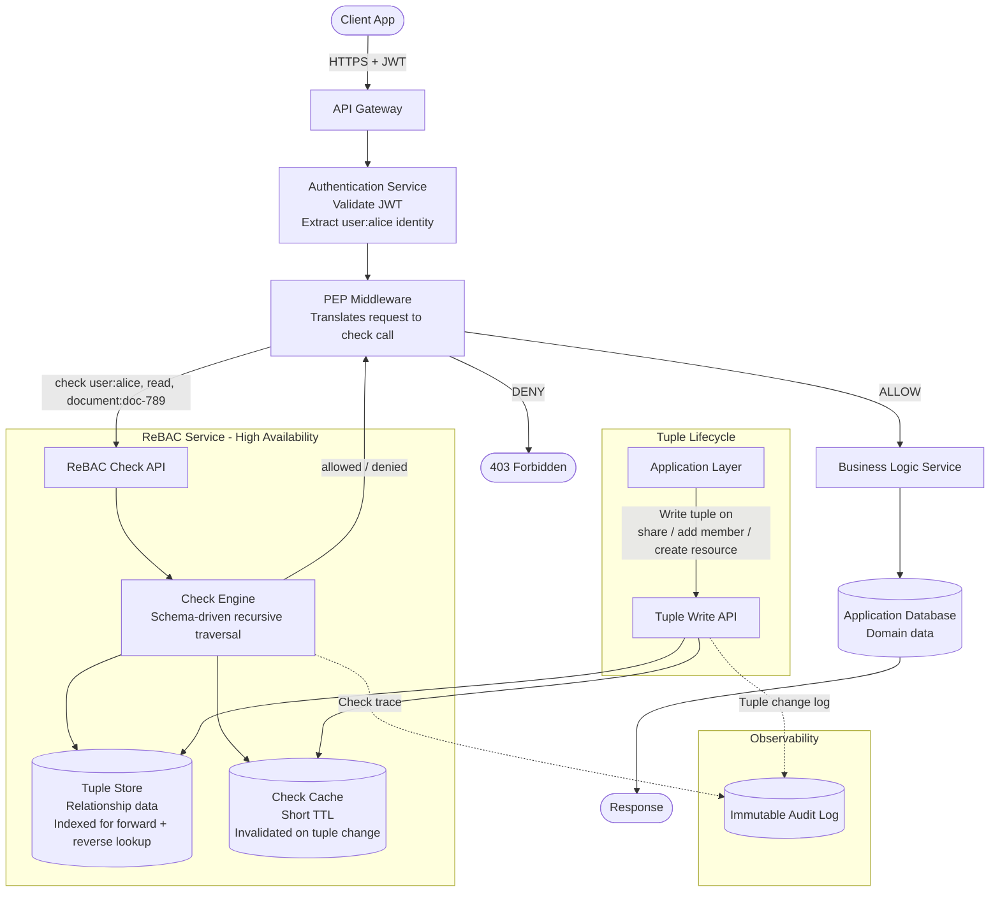

# Relationship-Based Access Control (ReBAC)

## 1. Overview

Relationship-Based Access Control (ReBAC) is an authorization model in which access decisions are derived from the **graph of relationships between entities** — users, groups, resources, and organizational structures. Rather than asking "what role does this user have?" or "what attributes does this resource carry?", ReBAC asks: "does a path exist in the relationship graph between this user and this resource that satisfies the required permission?"

The key insight of ReBAC is that many real-world authorization requirements are fundamentally relational. Access to a resource is often not a direct property of the user or the resource in isolation — it emerges from how users, groups, teams, organizations, and resources are connected to each other.

ReBAC was formalized and popularized by Google's Zanzibar paper (2019), which described the authorization system that powers Google Drive, Docs, Calendar, Maps, and YouTube. Zanzibar introduced the terminology of **tuples**, **userset rewrites**, and **check calls** that has influenced most modern ReBAC implementations (including SpiceDB, OpenFGA, Permify, and Ory Keto).

### What problem does ReBAC solve?

Consider a collaborative SaaS platform:

- A user is a member of a team.
- That team is a collaborator on a project.
- The project contains a set of documents.
- Each document inherits the permissions of its parent project.

The question "can Alice read this document?" has no answer in isolation. The answer depends on whether Alice is in a team, whether that team has a relationship with the project, and whether the project's relationships propagate to its documents. This is a graph traversal problem, not a role lookup or an attribute evaluation.

Standard RBAC would require a role per project per team — leading to role explosion. ACL-based FGAC would require individual ACEs for every user-document pair — leading to millions of entries. ABAC would require attributes that encode the full organizational membership context — an awkward fit.

ReBAC solves this by making relationships first-class data and answering access questions by traversing the relationship graph.

### What limitations of simpler models does ReBAC address?

| Simpler model | Limitation addressed by ReBAC |
|---|---|
| RBAC | Cannot express per-resource collaborative access without role explosion |
| FGAC (ACL) | Millions of ACEs needed to represent team/org membership and inheritance |
| ABAC | Organizational membership encoded as attributes is brittle and impractical at scale |
| Hardcoded ownership | Can express only direct ownership, not delegated, inherited, or group-derived access |

---

## 2. Core Concepts

### 2.1 Object

An **object** is any identifiable entity in the system that can be the target of an authorization check — a resource, a group, a team, an organization, a project, a document. In ReBAC, objects are not just passive resources; they can also be subjects of relationships (e.g., a group object that has members).

Objects are identified by a type and an ID:

```
document:doc-789
project:proj-20
team:team-engineering
organization:org-acme
user:alice
```

**Example:** `document:doc-789` is the object representing a specific document.

---

### 2.2 Relation

A **relation** is a named, directed edge between two objects in the relationship graph. Relations describe how entities are connected. A relation has a name that carries semantic meaning in the authorization model.

**Example relations:**

| From | Relation | To |
|---|---|---|
| `user:alice` | `member` | `team:engineering` |
| `team:engineering` | `collaborator` | `project:proj-20` |
| `document:doc-789` | `parent` | `project:proj-20` |
| `user:bob` | `owner` | `document:doc-789` |

---

### 2.3 Tuple (Relationship Record)

A **tuple** is the atomic unit of the relationship graph. It is a stored record that states: "object X has relation R to object Y." Tuples are the data that the authorization system reads to answer permission questions.

A tuple takes the form:

```
( object, relation, subject )
```

Where `subject` can be either a direct user identity or a **userset** (a set of users defined by their relationship to another object).

**Example tuples:**

```
(team:engineering,   member,       user:alice)
(project:proj-20,    collaborator, team:engineering#member)
(document:doc-789,   parent,       project:proj-20)
(document:doc-789,   owner,        user:bob)
```

The notation `team:engineering#member` means "users who have the `member` relation to `team:engineering`" — this is a **userset reference**, allowing groups and organizational hierarchies to be expressed without enumerating individual members.

---

### 2.4 Userset

A **userset** is a set of users defined by a relationship to an object, rather than by explicit enumeration. Usersets allow hierarchical and group-based access to be expressed in a single tuple rather than one tuple per user.

**Example:** Instead of creating one tuple per member of the engineering team to grant them collaborator access to a project, a single tuple is created:

```
(project:proj-20, collaborator, team:engineering#member)
```

This means: "the collaborator relation on project:proj-20 is held by all users who are members of team:engineering." When team membership changes, no project tuple changes are needed.

---

### 2.5 Permission

A **permission** is a derived, computed access right. Permissions are not stored as tuples — they are defined in the **schema** as logical expressions over relations. A permission is satisfied when the defined expression evaluates to true given the current state of the relationship graph.

**Example schema definition:**
```
permission read = owner OR collaborator OR viewer OR parent->reader
permission write = owner OR collaborator
permission delete = owner
```

Here, `parent->reader` means: "the user has the `reader` permission on the parent object" — enabling permission inheritance through the hierarchy.

---

### 2.6 Schema (Type System / Namespace Configuration)

The **schema** defines the valid object types, the relations between them, and how permissions are computed from those relations. It is the authorization model definition.

**Example schema (pseudocode):**

```
type user {}

type team {
  relation member: user
}

type project {
  relation owner: user
  relation collaborator: user | team#member
  relation viewer: user | team#member

  permission read  = owner OR collaborator OR viewer
  permission write = owner OR collaborator
  permission admin = owner
}

type document {
  relation owner: user
  relation parent: project

  permission read   = owner OR parent->read
  permission write  = owner OR parent->write
  permission delete = owner
}
```

This schema expresses that a document's read permission is granted either to its direct owner or to anyone who has read permission on its parent project — which in turn is granted to project owners, collaborators, and viewers, which can include team members.

---

### 2.7 Check

A **check** is an authorization query: "does subject S have permission P on object O?" The ReBAC system answers this by traversing the relationship graph according to the schema's permission definitions and returning `allowed` or `denied`.

**Example check:**
```
check: user:alice | read | document:doc-789
```

The system traverses:
1. Does `user:alice` have a direct tuple `(document:doc-789, read, user:alice)`? No.
2. Is `read = owner OR parent->read`? Check `owner`: No. Check `parent->read`:
3. Does `document:doc-789` have relation `parent` to any project? Yes: `project:proj-20`.
4. Does `user:alice` have `read` permission on `project:proj-20`?
5. Is `read = owner OR collaborator OR viewer`? Check `collaborator`:
6. Does `project:proj-20` have relation `collaborator` to `user:alice` or a userset containing `user:alice`?
7. Yes: `(project:proj-20, collaborator, team:engineering#member)`. Is `user:alice` a member of `team:engineering`?
8. Check: `(team:engineering, member, user:alice)` — YES.
9. Path found → **ALLOWED**.

---

### 2.8 Expand (Userset Resolution)

**Expand** is a complementary operation to check: given an object and a permission, expand returns the complete set of users who hold that permission. It is used for debugging ("who can access this document?"), for building "shared with me" views, and for access reviews.

---

### 2.9 Tuple Store

The **tuple store** is the database that stores all relationship tuples. It is the authoritative source of the relationship graph. Every permission check reads from the tuple store. The tuple store must be optimized for the specific query patterns of ReBAC: look up all subjects related to an object, and look up all objects related to a subject.

---

## 3. How It Works

ReBAC evaluates permission questions by recursively traversing the relationship graph until a path between the subject and the object is found (or all paths are exhausted).

```mermaid
flowchart TD
    A([Incoming Request\nuser:alice | action:read | document:doc-789]) --> PEP

    PEP[Policy Enforcement Point\nTranslates request to check call] -->|check user:alice, read, document:doc-789| Engine

    subgraph ReBAC Authorization Engine
        Engine[Check Handler\nLook up permission definition in schema] --> Q1{Direct tuple exists?\ndocument:doc-789, read, user:alice}
        Q1 -- Yes --> Allow([✅ ALLOWED])
        Q1 -- No --> Expand[Expand permission expression\nread = owner OR parent → read]

        Expand --> Q2{owner tuple\nmatches alice?}
        Q2 -- Yes --> Allow
        Q2 -- No --> Q3{parent object found?\ndocument:doc-789 → parent → project:proj-20}
        Q3 -- No --> Deny([❌ DENIED])
        Q3 -- Yes --> Recurse[Recursive check:\nuser:alice | read | project:proj-20]

        Recurse --> Q4{collaborator userset\nincludes alice via team?}
        Q4 -- Yes --> Allow
        Q4 -- No --> Deny
    end

    Engine -->|allowed / denied| PEP
    PEP -->|ALLOW| BL([Business Logic])
    PEP -->|DENY| Err([403 Forbidden])

    Engine -.->|Tuple lookups| TS[(Tuple Store)]
    Engine -.->|Schema lookups| Schema[(Schema / Namespace Config)]
```

**Step-by-step:**

1. **Request intercepted** — The PEP receives a request and translates it to a check call: `(user, permission, object)`.
2. **Schema lookup** — The engine loads the permission definition from the schema to understand how to evaluate the given permission.
3. **Direct tuple check** — The engine queries the tuple store for a direct tuple matching the subject, relation, and object.
4. **Userset expansion** — If the permission definition references other relations or computed permissions (e.g., `parent->read`), the engine expands each userset recursively.
5. **Recursive traversal** — For each referenced object (e.g., the parent project), the engine performs another check call. This continues until a path is found or all paths are exhausted.
6. **Decision** — If any traversal path finds a matching tuple, the check returns ALLOWED. If no path is found, the check returns DENIED.
7. **Enforcement** — The PEP enforces the decision.

---

## 4. Data Model

```
Object (any entity in the system)
├── type: string        -- e.g. "user", "document", "project", "team", "organization"
└── id: string          -- unique within type, e.g. "doc-789", "alice", "eng-team"

Relation Tuple (the core data unit)
├── objectType: string  -- the object type (e.g. "document")
├── objectId: string    -- the object id (e.g. "doc-789")
├── relation: string    -- the relation name (e.g. "owner", "parent", "member")
├── subjectType: string -- the subject type (e.g. "user", "team")
├── subjectId: string   -- the subject id (e.g. "alice", "eng-team")
├── subjectRelation: string? -- if set, this is a userset reference (e.g. "member")
│                               meaning "all subjects with `member` relation to this subject object"
├── createdAt: timestamp
└── createdBy: string   -- audit: who established this relationship

Schema (static configuration, not per-request data)
├── ObjectTypeDefinition[]
│   ├── typeName: string
│   ├── relations: RelationDefinition[]
│   │   ├── name: string
│   │   └── allowedSubjectTypes: string[]  -- type constraints
│   └── permissions: PermissionDefinition[]
│       ├── name: string
│       └── expression: PermissionExpression  -- union/intersection/exclusion of relations
│
└── PermissionExpression (recursive type)
    ├── union: PermissionExpression[]        -- OR
    ├── intersection: PermissionExpression[] -- AND
    ├── exclusion: { base, subtract }        -- base MINUS subtract
    ├── computedUserset: relation name       -- refers to another relation on this object
    └── tupleToUserset: { tupleset, computedUserset }
        -- e.g. "parent->read": find the parent object, then check `read` on it
```

**Key design points:**

- The tuple store is append-oriented with logical deletes (tuples are marked inactive rather than deleted, for audit purposes).
- Tuples are indexed on both `(objectType, objectId, relation)` and `(subjectType, subjectId)` to support both check (forward traversal) and list (reverse traversal) operations.
- The schema is static and versioned — schema changes require migration planning.

---

## 5. Authorization Decision

### Inputs

| Input | Description |
|---|---|
| `subject` | The entity requesting access: `user:alice` |
| `permission` | The permission being checked: `read` |
| `object` | The resource being accessed: `document:doc-789` |

### Evaluation Logic (recursive check)

```
function check(subject, permission, object):

    // 1. Look up the permission expression in the schema
    expression = schema.getPermission(object.type, permission)

    if expression is a UNION:
        // Permission is satisfied if ANY sub-expression is satisfied
        for each subExpr in expression.operands:
            if check(subject, subExpr, object) == ALLOWED:
                return ALLOWED
        return DENIED

    if expression is an INTERSECTION:
        // Permission is satisfied only if ALL sub-expressions are satisfied
        for each subExpr in expression.operands:
            if check(subject, subExpr, object) == DENIED:
                return DENIED
        return ALLOWED

    if expression is a COMPUTED_USERSET (direct relation reference):
        // Check if a direct tuple exists: (object, relation, subject)
        // or if subject is in a userset reachable from object via this relation
        subjects = expandUserset(object, expression.relation)
        if subject IN subjects: return ALLOWED
        return DENIED

    if expression is a TUPLE_TO_USERSET (e.g. parent->read):
        // Find all objects related to the current object via the tupleset relation
        relatedObjects = getTuples(object, expression.tupleset)
        for each relatedObject in relatedObjects:
            if check(subject, expression.computedUserset, relatedObject) == ALLOWED:
                return ALLOWED
        return DENIED

function expandUserset(object, relation):
    tuples = tupleStore.getTuples(object, relation)
    result = Set()
    for each tuple in tuples:
        if tuple.subjectRelation is null:
            result.add(tuple.subject)  // direct user
        else:
            // Expand the userset: all members of tuple.subject with tuple.subjectRelation
            result.addAll(expandUserset(tuple.subject, tuple.subjectRelation))
    return result
```

### Allow condition

A path exists in the relationship graph, following the schema's permission expression tree, that connects the subject to the object via the required permission.

### Deny condition

No path exists. All branches of the permission expression tree are exhausted without finding a match between the subject and the object.

### Explicit exclusion (negative permissions)

Some ReBAC systems support **exclusion** in permission expressions: `read = (owner OR collaborator) MINUS banned`. A user in the `banned` relation is excluded from the `read` permission even if they would otherwise qualify via another path.

### Default behavior

**Default-deny.** If no path connecting the subject to the object via the required permission exists, access is denied.

### Caveats

- **Cycles:** The schema must be designed to avoid infinite loops in the relationship graph. Well-designed schemas are acyclic; implementations add depth limits as a guard.
- **Consistency:** In distributed tuple stores, there is a brief window after a tuple write where the change may not be visible to all check operations. Systems like Zanzibar address this with **zookies** (consistency tokens) that allow callers to request a check that is consistent with a specific point in time.

---

## 6. Practical Example

### Scenario: SaaS Project Management and Document Platform

**Schema (abbreviated):**

```
type user {}

type team {
  relation member: user
}

type organization {
  relation member: user | team#member
  relation admin:  user
}

type project {
  relation owner:        user
  relation collaborator: user | team#member
  relation viewer:       user | team#member | organization#member

  permission read   = owner OR collaborator OR viewer
  permission write  = owner OR collaborator
  permission admin  = owner
}

type document {
  relation owner:  user
  relation parent: project

  permission read   = owner OR parent->read
  permission write  = owner OR parent->write
  permission delete = owner
}
```

---

**Tuples:**

```
(team:engineering,   member,       user:alice)
(team:engineering,   member,       user:carol)
(organization:acme,  member,       team:engineering#member)
(project:proj-20,    owner,        user:bob)
(project:proj-20,    collaborator, team:engineering#member)
(document:doc-789,   owner,        user:bob)
(document:doc-789,   parent,       project:proj-20)
(document:doc-790,   parent,       project:proj-20)
```

**Users:**

| User | Direct Roles | Group Memberships |
|---|---|---|
| alice | — | `team:engineering` |
| bob | owner of `proj-20`, owner of `doc-789` | — |
| carol | — | `team:engineering` |
| dave | — | — |

---

**Allowed request — group-inherited access:**

> Alice checks `read` on `document:doc-789`.

Traversal:
1. `read = owner OR parent->read` on `document:doc-789`.
2. `owner`: Is there `(doc-789, owner, alice)`? No.
3. `parent->read`: Find parent: `(doc-789, parent, project:proj-20)`.
4. Check `read` on `project:proj-20` for `user:alice`.
5. `read = owner OR collaborator OR viewer`.
6. `collaborator`: Is there `(proj-20, collaborator, alice)` or via userset? Check `(proj-20, collaborator, team:engineering#member)`. Is `alice` a member of `team:engineering`? YES.
7. Path found → **ALLOWED**.

---

**Denied request — no relationship path:**

> Dave checks `read` on `document:doc-789`.

Traversal:
1. `owner`: No `(doc-789, owner, dave)`.
2. `parent->read` → check `read` on `project:proj-20` for `user:dave`.
3. `owner`: No. `collaborator`: No direct tuple; userset `team:engineering#member` — is `dave` a member? No. `viewer`: No tuples matching `dave`.
4. All paths exhausted → **DENIED**.

---

**Allowed request — direct ownership:**

> Bob checks `delete` on `document:doc-789`.

1. `delete = owner`.
2. Is there `(doc-789, owner, bob)`? YES.
3. Path found → **ALLOWED** (direct tuple, no traversal needed).

---

**Allowed request — inherited via organization:**

Add a new tuple: `(project:proj-20, viewer, organization:acme#member)`

Now `user:dave` is added to `organization:acme`:
`(organization:acme, member, user:dave)`

> Dave checks `read` on `document:doc-789`.

1. `parent->read` → check `read` on `project:proj-20` for `dave`.
2. `viewer`: Check `(proj-20, viewer, organization:acme#member)`. Is `dave` a member of `organization:acme`? YES.
3. **ALLOWED**.

---

## 7. Implementation Example

```typescript
// --- Types ---

interface Tuple {
  objectType: string;
  objectId: string;
  relation: string;
  subjectType: string;
  subjectId: string;
  subjectRelation?: string; // if set, this is a userset reference
}

type PermissionExpr =
  | { type: "union";         operands: PermissionExpr[] }
  | { type: "intersection";  operands: PermissionExpr[] }
  | { type: "relation";      relation: string }                           // direct relation check
  | { type: "ttu";           tupleset: string; computedUserset: string }; // tuple-to-userset

interface Schema {
  getPermissionExpression(objectType: string, permission: string): PermissionExpr;
}

// --- Tuple store (in-memory for illustration) ---

const tuples: Tuple[] = [
  { objectType: "team",     objectId: "engineering", relation: "member",       subjectType: "user",    subjectId: "alice" },
  { objectType: "team",     objectId: "engineering", relation: "member",       subjectType: "user",    subjectId: "carol" },
  { objectType: "project",  objectId: "proj-20",     relation: "owner",        subjectType: "user",    subjectId: "bob" },
  { objectType: "project",  objectId: "proj-20",     relation: "collaborator", subjectType: "team",    subjectId: "engineering", subjectRelation: "member" },
  { objectType: "document", objectId: "doc-789",     relation: "owner",        subjectType: "user",    subjectId: "bob" },
  { objectType: "document", objectId: "doc-789",     relation: "parent",       subjectType: "project", subjectId: "proj-20" },
];

function getTuples(objectType: string, objectId: string, relation: string): Tuple[] {
  return tuples.filter(
    t => t.objectType === objectType && t.objectId === objectId && t.relation === relation
  );
}

// --- Schema (simplified) ---

const schema: Schema = {
  getPermissionExpression(objectType, permission): PermissionExpr {
    const definitions: Record<string, Record<string, PermissionExpr>> = {
      project: {
        read: {
          type: "union",
          operands: [
            { type: "relation", relation: "owner" },
            { type: "relation", relation: "collaborator" },
            { type: "relation", relation: "viewer" },
          ],
        },
        write: {
          type: "union",
          operands: [
            { type: "relation", relation: "owner" },
            { type: "relation", relation: "collaborator" },
          ],
        },
      },
      document: {
        read: {
          type: "union",
          operands: [
            { type: "relation", relation: "owner" },
            { type: "ttu", tupleset: "parent", computedUserset: "read" },
          ],
        },
        delete: { type: "relation", relation: "owner" },
      },
    };
    return definitions[objectType]?.[permission]
      ?? (() => { throw new Error(`No permission '${permission}' on type '${objectType}'`); })();
  },
};

// --- Check engine ---

const MAX_DEPTH = 10;

function check(
  subjectType: string, subjectId: string,
  permission: string,
  objectType: string, objectId: string,
  depth = 0
): boolean {
  if (depth > MAX_DEPTH) return false; // cycle / depth guard

  const expr = schema.getPermissionExpression(objectType, permission);
  return evalExpr(expr, subjectType, subjectId, objectType, objectId, depth);
}

function evalExpr(
  expr: PermissionExpr,
  subjectType: string, subjectId: string,
  objectType: string, objectId: string,
  depth: number
): boolean {
  switch (expr.type) {
    case "union":
      return expr.operands.some(op =>
        evalExpr(op, subjectType, subjectId, objectType, objectId, depth)
      );

    case "intersection":
      return expr.operands.every(op =>
        evalExpr(op, subjectType, subjectId, objectType, objectId, depth)
      );

    case "relation": {
      // Check if subject is directly in this relation, or reachable via a userset
      const related = getTuples(objectType, objectId, expr.relation);
      return related.some(t => {
        if (t.subjectRelation == null) {
          // Direct subject match
          return t.subjectType === subjectType && t.subjectId === subjectId;
        } else {
          // Userset: recurse — check if subjectId has t.subjectRelation on t.subjectId
          return check(subjectType, subjectId, t.subjectRelation, t.subjectType, t.subjectId, depth + 1);
        }
      });
    }

    case "ttu": {
      // Tuple-to-userset: find the related object via tupleset, then check computedUserset on it
      const parents = getTuples(objectType, objectId, expr.tupleset);
      return parents.some(t =>
        check(subjectType, subjectId, expr.computedUserset, t.subjectType, t.subjectId, depth + 1)
      );
    }
  }
}

// --- Usage ---

// Alice reads doc-789 (via team:engineering → project:proj-20 → document:doc-789)
console.log(check("user", "alice", "read", "document", "doc-789")); // true

// Dave reads doc-789 (no path)
console.log(check("user", "dave", "read", "document", "doc-789")); // false

// Bob deletes doc-789 (direct owner)
console.log(check("user", "bob", "delete", "document", "doc-789")); // true

// Alice deletes doc-789 (not owner)
console.log(check("user", "alice", "delete", "document", "doc-789")); // false
```

---

## 8. Advantages

### Natural expression of organizational access patterns

Team membership, organizational hierarchy, project collaboration, and resource inheritance map directly and intuitively onto tuples and permission expressions. The authorization model mirrors the mental model users and developers already have.

### Eliminates role explosion

Because access is derived from graph relationships rather than explicit role assignments, there is no need to create a `project-A-member` role for every project. A single `collaborator` relation on a project object, combined with a team membership tuple, expresses the same access for all current and future members of that team.

### Scales to millions of resources

Tuple storage scales horizontally. Adding a new document to a project requires only a single `(document:new-doc, parent, project:proj-20)` tuple — not one ACE per user. Changes to team membership automatically propagate to all downstream resource access without additional writes.

### Enables powerful "list" operations

Because relationships are stored as first-class data, the system can answer queries like:
- "What documents can alice access?" (reverse lookup)
- "Who can access this document?" (expand)
- "List all projects this team has collaborator access to." (graph traversal)

These queries are the foundation of "shared with me" views, access reviews, and security dashboards.

### Consistency-aware access control

Google's Zanzibar introduced **consistency tokens** (zookies) that allow callers to ensure a permission check reflects a specific version of the relationship graph. This prevents scenarios where a user's access is revoked but a stale check still returns ALLOWED during the propagation window.

### Composable permissions

Permissions are defined as logical expressions over relations. Complex access patterns — "can edit if owner OR team collaborator, but not if in the blocked list" — are expressed cleanly using union, intersection, and exclusion operators in the schema.

---

## 9. Limitations and Trade-offs

### Complexity of schema design

Designing a correct ReBAC schema is non-trivial. Poorly designed schemas produce unexpected access (permission leakage via an unanticipated traversal path) or unexpectedly block access (a path exists but the schema doesn't traverse it). The schema is a critical security artifact that requires careful design and testing.

### Recursive traversal performance

For deep relationship hierarchies or wide usersets, a check call may require many recursive tuple lookups. Without caching and careful index design, check latency can grow with the depth of the graph. The Zanzibar paper describes sophisticated strategies (parallel evaluation, leopard indexing) to keep latency bounded at Google scale — most smaller systems do not need that level of optimization but must still think carefully about traversal depth.

### No native attribute-based conditions

ReBAC expresses access through relationships, not attribute conditions. A requirement like "only allow access during business hours" or "block access to documents classified as confidential from external networks" is not naturally expressible in a pure ReBAC model. These conditions require layering ABAC or PBAC on top.

### Tuple store becomes a critical data store

The tuple store is queried on every authorization check. It must be high-availability, low-latency, and consistently up-to-date. It is not a secondary system — it is as critical as the application database.

### Debugging access issues

Tracing why a user does or does not have access requires traversing the full relationship graph. The path may go through several intermediate objects and usersets. Good tooling (expand operations, check trace output) is essential for debugging.

### Schema evolution is costly

Changing the schema — adding a new relation type, modifying a permission expression — can have broad effects on existing access decisions. Schema changes must be backward-compatible or involve a careful migration. Unlike RBAC where adding a role is isolated, schema changes in ReBAC affect all objects of the changed type.

### Operational maturity requirement

Running a production ReBAC system requires expertise in tuple store operations, schema versioning, consistency management, and check performance profiling. Teams without prior experience will encounter a steeper learning curve than with RBAC or FGAC.

---

## 10. When to Use It

ReBAC excels when:

- **Access is determined by organizational relationships.** Team membership, department hierarchy, project participation, and org-level roles are all relationships.
- **Resources are hierarchically organized.** Documents within projects, projects within workspaces, workspaces within organizations — inheritance through parent relationships is a natural ReBAC pattern.
- **Per-resource collaboration is a core feature.** "Invite this team to this project," "share this document with this user," and "make this resource public" are all tuple write operations.
- **The system needs to support "list" or "search" operations scoped to user access.** "Show me all documents I can read" requires reverse relationship traversal.
- **The authorization model is relationship-heavy rather than role-heavy or attribute-heavy.**

**Realistic scenarios:**

| Scenario | Why ReBAC fits |
|---|---|
| Collaborative SaaS (Notion, Figma, Confluence style) | Workspace/team/resource hierarchy; per-item sharing |
| Source code hosting (GitHub/GitLab style) | Org → team → repository → branch permission inheritance |
| Project management tools | Team members inherit project and task access |
| Cloud infrastructure IAM | Account → project → resource relationship hierarchies |
| Social platforms | Follow, friend, group membership as authorization relationships |
| Multi-tenant B2B SaaS | Organization → department → user hierarchies with resource inheritance |

---

## 11. When Not to Use It

- **Access is driven by data classification and environmental context.** "Only allow access to confidential documents from VPN during business hours" is an attribute condition, not a relationship. Use ABAC or PBAC.
- **The authorization model is flat and role-based.** If users fall into a small number of job function roles with uniform permissions across all resources of a type, RBAC is simpler and sufficient.
- **The team lacks expertise to design and maintain a schema.** A poorly designed ReBAC schema is a significant security liability. If the team is not ready to invest in schema design and ongoing maintenance, a well-disciplined RBAC model is safer.
- **Real-time conditions must influence decisions.** Relationship graphs are updated asynchronously; they do not capture ephemeral environmental context. For time-based or network-based restrictions, combine ReBAC with ABAC.
- **The relationship graph is extremely dense.** If nearly every user has a relationship to every resource (e.g., a public resource sharing model where all users can read everything), the relationship graph does not provide selectivity and RBAC or attribute-based open access is more efficient.

---

## 12. Comparison With Other Authorization Models

| Model | Main Idea | Decision Inputs | Complexity | Best For |
|---|---|---|---|---|
| **ReBAC** | Access derived from graph relationships between entities | Graph traversal from subject to object via schema-defined permission expressions | Medium–High | Collaborative tools; hierarchical resources; team/org-based access; "shared with me" features |
| **RBAC** | Permissions assigned to roles; users assigned to roles | User's role memberships | Low–Medium | Organizations with clear job functions; class-level resource access |
| **FGAC** | Per-instance ACLs; explicit grants per subject/resource | Subject identity, resource instance ACL | Medium | Ownership-driven sharing; explicit per-user grants |
| **ABAC** | Policies evaluated against attributes of subject, resource, and environment | Attribute sets + policy rules | High | Context-sensitive access; data classification; heterogeneous resource types |
| **PBAC** | Externalized, centralized declarative policies with formal governance | Attributes + centralized policy set | Very High | Enterprise-wide consistent enforcement; compliance-driven multi-service architectures |

ReBAC and FGAC overlap in use cases involving per-resource access control. The key distinction is that FGAC stores explicit per-user ACEs, while ReBAC stores group/team membership and hierarchy relationships and derives individual access through graph traversal. ReBAC is more efficient when access is group- or org-driven; FGAC is simpler when access is primarily individual-user-driven.

---

## 13. Security Considerations

### Schema design as a security artifact

The schema determines what traversal paths exist in the relationship graph. An incorrect permission expression can create an unanticipated path that grants access to unintended subjects. The schema must be reviewed by security engineers, not only by product engineers. Changes to permission expressions in the schema require security sign-off.

### Privilege escalation via relationship injection

If an attacker can insert arbitrary tuples into the tuple store, they can create relationships that grant unauthorized access. Tuple write operations must be protected by their own authorization checks (who is allowed to create which relations on which object types). This is a recursive security requirement: use the ReBAC system itself to govern who can write tuples.

### Tenant isolation

In multi-tenant systems, the `objectId` namespace must be globally unique and tenant-scoped. A tuple that connects `user:alice` to `document:123` in tenant A must not match a `document:123` in tenant B. Use namespaced IDs: `document:tenantA/doc-123` or include tenant IDs in all lookups. Tenant boundary enforcement must be validated explicitly in tests.

### Default-deny

The absence of a path in the relationship graph is a denial. Ensure the system never silently falls through to an implicit allow when a check fails due to a store error or timeout. Check failures must be treated as denials, not as unknown.

### Tuple store integrity and immutability

Deleting or modifying existing tuples should be treated as a privileged, auditable operation. In high-security systems, implement logical deletes (mark as inactive with a timestamp) rather than physical deletes, to preserve audit trail completeness.

### Consistency tokens and TOCTOU

Between the moment a tuple is written (e.g., revoking a user's access) and the moment the check propagates to all read replicas, there is a window where the revoked access may still be reported as allowed. For high-security operations (revoking access to sensitive resources), use consistency tokens to enforce check freshness, or synchronously wait for propagation before confirming the revocation.

### Authorization caching

Caching check results speeds up frequently repeated queries but creates a window where revoked access remains effective. Use short TTLs for cached check results. For sensitive permissions (delete, admin), disable caching or invalidate on tuple change.

### Audit logging

Log every check call with: subject, permission, object, decision, traversal trace, and timestamp. The traversal trace is essential for debugging unexpected decisions and for compliance audits that ask "why did this user have access to this resource at this time?"

---

## 14. Performance Considerations

### Index design for the tuple store

The two primary query patterns are:

1. **Forward lookup** — Given `(objectType, objectId, relation)`, return all matching subject tuples. Supports check and expand operations.
2. **Reverse lookup** — Given `(subjectType, subjectId)`, return all objects where this subject appears. Supports "list all resources I can access" queries.

Both queries must be supported by database indexes. A composite index on `(objectType, objectId, relation)` and a second index on `(subjectType, subjectId, subjectRelation)` cover the most common patterns.

### Check result caching

Cache the result of `check(subject, permission, object)` keyed by `(subjectId, permission, objectId)`. Check results are safe to cache for short periods (seconds to minutes) because they change only when a relevant tuple is added or removed.

Invalidate cached results selectively when a tuple change affects an object or a subject that is part of a cached key.

### Depth-limited traversal

Set a maximum traversal depth (e.g., 15 hops) to prevent unbounded recursion on pathological graphs. Log a warning when the depth limit is reached rather than silently returning DENIED — hitting the depth limit may indicate a schema design problem.

### Parallel branch evaluation

When a permission expression is a union of multiple branches, evaluate the branches in parallel rather than sequentially. Return ALLOWED as soon as the first branch resolves to ALLOWED without waiting for the others. This reduces average latency when the first branch is the most commonly satisfied.

### Reverse-index for list operations

"List all documents user:alice can read" requires traversing the relationship graph in reverse. Maintain a reverse index that maps from `(subjectId, permission)` to `objectId` sets. This index must be updated on every tuple write and is more expensive to maintain but essential for scalable list operations.

### Avoiding the N+1 check problem

When rendering a list of resources, avoid making one check call per resource item. Use the reverse index to fetch all accessible resource IDs for the user in a single query, then load only those resources from the application database.

---

## 15. Testing Strategy

### Unit tests — direct tuple check

```
Test: Direct owner relation
Given: tuple (document:doc-789, owner, user:bob) exists
When:  check("user", "bob", "delete", "document", "doc-789")
Then:  ALLOWED
```

```
Test: No direct tuple → denied
Given: no tuple connects user:dave to document:doc-789
When:  check("user", "dave", "read", "document", "doc-789")
Then:  DENIED
```

### Unit tests — userset traversal

```
Test: Access via group membership
Given: (team:engineering, member, user:alice)
       (project:proj-20, collaborator, team:engineering#member)
When:  check("user", "alice", "read", "project", "proj-20")
Then:  ALLOWED (alice → team:engineering → proj-20 collaborator → read)
```

```
Test: Non-member of group denied
Given: user:dave is NOT a member of team:engineering
When:  check("user", "dave", "read", "project", "proj-20")
Then:  DENIED
```

### Unit tests — hierarchical inheritance (tuple-to-userset)

```
Test: Document inherits permissions from parent project
Given: (document:doc-789, parent, project:proj-20)
       alice has read permission on project:proj-20
When:  check("user", "alice", "read", "document", "doc-789")
Then:  ALLOWED (via parent->read path)
```

```
Test: Removing team membership revokes inherited document access
Given: alice is removed from team:engineering
When:  check("user", "alice", "read", "document", "doc-789")
Then:  DENIED (path through team no longer exists)
```

### Negative authorization tests

```
Test: Viewer cannot write
Given: alice has read permission on project:proj-20 via viewer relation only
When:  check("user", "alice", "write", "project", "proj-20")
Then:  DENIED (write requires owner OR collaborator, not viewer)
```

```
Test: Non-owner cannot delete
Given: alice has write permission but is not owner
When:  check("user", "alice", "delete", "document", "doc-789")
Then:  DENIED
```

### Privilege escalation tests

```
Test: User cannot write tuples without authorization
Given: user:dave has no write-tuple permission
When:  dave attempts to insert (project:proj-20, owner, user:dave)
Then:  tuple write is rejected (authorization check on tuple write fails)
```

```
Test: Userset cannot reference out-of-scope objects
Given: schema defines that `document` parent must be of type `project`
When:  a tuple (document:doc-789, parent, user:alice) is attempted
Then:  tuple is rejected (schema type constraint violation)
```

### Multi-tenant isolation tests

```
Test: User from tenant A cannot access resources in tenant B
Given: alice belongs to tenant "acme"; document:globex/doc-456 belongs to tenant "globex"
When:  check("user", "alice", "read", "document", "globex/doc-456")
Then:  DENIED (no path connects alice to globex-scoped objects)
```

### Integration tests — tuple lifecycle

```
Test: New team member immediately gains inherited access
Given: user:eve is added to team:engineering via a new tuple
When:  check("user", "eve", "read", "document", "doc-789")
Then:  ALLOWED (new tuple propagated correctly)
```

```
Test: Access revocation propagates correctly
Given: (team:engineering, member, user:alice) tuple is deleted
When:  check("user", "alice", "read", "document", "doc-789")
Then:  DENIED (cache invalidated, revocation effective)
```

### Expand / reverse lookup tests

```
Test: Expand returns all users with read access to a document
Given: alice (via team), bob (direct owner)
When:  expand("read", "document", "doc-789")
Then:  result set contains user:alice AND user:bob
```

---

## 16. Real-World Architecture

ReBAC requires a dedicated tuple store and check engine alongside the application's existing data stores.



### Tuple writes as application events

Tuple writes are tightly coupled to application domain events:
- **Create a resource** → write `(resource, parent, parentObject)` and `(resource, owner, user)`
- **Add team member** → write `(team, member, user)`
- **Share with user** → write `(resource, viewer, user)`
- **Remove collaborator** → delete `(project, collaborator, user)`

These tuple write operations should be performed in the same transaction (or with strong consistency guarantees) as the application's domain changes. A resource created without its ownership tuple is inaccessible to everyone including its creator.

### ReBAC as a dedicated service

For multi-service architectures, the tuple store and check engine run as a standalone, high-availability service. All application services call the same check API. This ensures consistency and centralizes the relationship graph.

Open-source implementations like **OpenFGA**, **SpiceDB**, and **Permify** provide production-ready ReBAC services that can be self-hosted or used as managed cloud services, implementing the Zanzibar paper's approach.

### Integrating with ABAC for attribute conditions

For requirements that combine relationship-based access with attribute conditions (e.g., "team members can read internal documents but not confidential ones"), layer ReBAC with ABAC:

1. **ReBAC** determines whether the user has a relationship path to the resource (coarse filter).
2. **ABAC** evaluates attribute conditions on the resource and environment (fine filter).

Both checks must pass for access to be allowed.

---

## 17. Common Mistakes

### Mistake 1: Creating tuples at query time instead of write time

**Problem:** Instead of writing a `(document, parent, project)` tuple when the document is created, the application derives the parent relationship from the document record at check time by loading the document from the database.

**Why it is dangerous:** This bypasses the ReBAC system. The authorization engine does not know about the parent relationship. Permissions that depend on `parent->read` fail silently, denying access to legitimate users. Or worse, the application adds a special case in code to load the document before the authorization check, defeating the purpose of the authorization layer.

**Correct approach:** Every entity relationship that is used in authorization must be represented as a tuple in the tuple store, written at the time the relationship is established in the domain.

---

### Mistake 2: Not enforcing type constraints in the schema

**Problem:** The schema does not restrict which object types can appear as subjects of a given relation. A tuple `(document:doc-789, parent, user:alice)` is accepted even though the schema intends `parent` to reference `project` objects only.

**Why it is dangerous:** Unexpected tuple shapes can create unintended traversal paths that grant unauthorized access. A user who appears as the `parent` of a document gains any permissions that traverse `parent->*`.

**Correct approach:** Define explicit type constraints in the schema for every relation. Validate tuple writes against the schema before persisting them. Reject tuples that violate type constraints.

---

### Mistake 3: Designing permission expressions without tracing all traversal paths

**Problem:** A `read` permission expression is written as `owner OR parent->read` without considering that the `parent` relation could point to an object type with a very permissive `read` expression (e.g., a type where all authenticated users have `read`).

**Why it is dangerous:** All users end up with read access to all documents via the parent's open read expression — a permission leakage through an unanticipated traversal path.

**Correct approach:** Trace every possible traversal path in the schema before deploying a new permission expression. Use the expand operation to verify that the effective subject set for a permission is what you intend. Test with "who can access this resource?" queries against representative data.

---

### Mistake 4: Missing tuple cleanup on resource deletion

**Problem:** When a document is deleted, its tuples (`parent`, `owner`, `viewer`) remain in the tuple store.

**Why it is dangerous:** The tuple store accumulates stale data. More dangerously, if the resource ID is reused (with non-UUID IDs), the new resource silently inherits the old resource's relationship graph, including potentially unauthorized viewers.

**Correct approach:** Delete all tuples referencing a resource when the resource is deleted. Implement this as a transactional operation alongside the resource deletion. Use UUID resource IDs to prevent ID reuse.

---

### Mistake 5: Unbounded recursive traversal

**Problem:** The check engine has no depth limit. A schema that creates a cycle (object A is the parent of object B, and object B is the parent of object A) causes infinite recursion.

**Why it is dangerous:** Denial-of-service via a crafted relationship graph. Even without a cycle, deeply nested hierarchies (workspace → org → division → team → subteam → project → folder → document) can cause many recursive calls per check.

**Correct approach:** Implement a maximum traversal depth (e.g., 15–20 hops). Return DENIED and log a warning when the limit is exceeded. Design schemas to avoid deep nesting where possible.

---

### Mistake 6: Not building "explain" / trace tooling

**Problem:** The authorization system returns DENIED for a user who believes they should have access. The engineering team has no way to trace why the check failed — which path was evaluated, where it stopped, which tuples were missing.

**Why it is dangerous:** Access issues are time-consuming to debug. Users lose trust. In the worst case, a bug is misdiagnosed as a policy decision and never fixed, or a legitimate access gap is never identified.

**Correct approach:** Implement a check trace mode that returns the full evaluation path alongside the decision. Expose an expand endpoint that returns all subjects with a given permission on an object. These tools are essential for both debugging and access reviews.

---

## 18. Summary

**What it is:** Relationship-Based Access Control is an authorization model that derives access decisions from a graph of typed relationships between entities. Users, groups, teams, organizations, and resources are nodes; relations are edges. A permission check is a graph traversal question: does a path exist between this user and this resource via the schema's permission expression?

**How it works:** Relationships are stored as tuples in a tuple store. A schema defines which relations are valid between which object types and how permissions are computed from those relations using union, intersection, and exclusion expressions. On each authorization check, the engine traverses the graph recursively — following relation edges and userset expansions — until it finds a path (ALLOW) or exhausts all paths (DENY).

**Strengths:**
- Natural, intuitive expression of organizational access patterns
- Eliminates role explosion for team- and org-driven access control
- Scales efficiently: one team membership tuple grants access to all team-accessible resources
- Enables powerful reverse lookups for "list resources I can access" and "who can access this resource" queries
- Clean composable permission expressions via union, intersection, and exclusion

**Limitations:**
- Schema design is a security-critical artifact requiring careful design and testing
- Recursive traversal performance requires index design and caching discipline
- No native attribute-based conditions — combine with ABAC for context-sensitive decisions
- Tuple store is a critical dependency requiring high availability
- Schema evolution is costly compared to modifying RBAC role definitions

**When to use it:** ReBAC is the right model when authorization requirements are fundamentally relational — when access to a resource is derived from team membership, organizational hierarchy, project participation, or other first-class relationships between entities. It excels in collaborative SaaS platforms, hierarchical resource systems, and multi-tenant B2B products where users share and collaborate on specific resources. For purely role-driven access with no per-resource sharing, RBAC is simpler. For attribute-driven, context-sensitive policies, combine ReBAC with ABAC.
